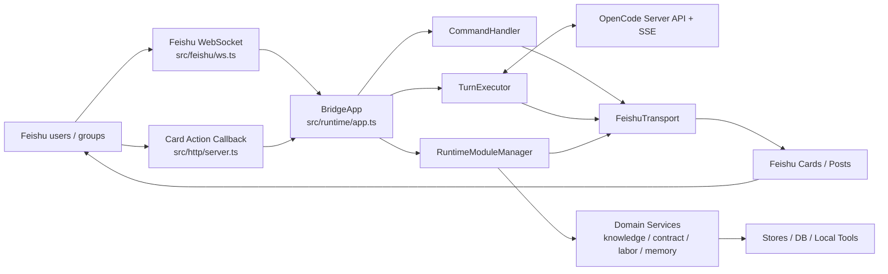
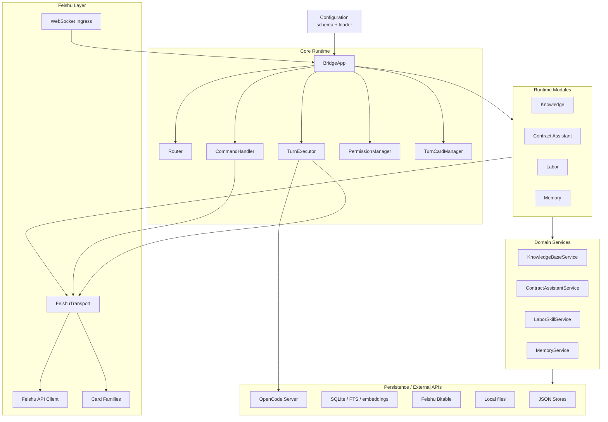

# Feishu OpenCode Bridge

[](https://nodejs.org/)
[](https://www.typescriptlang.org/)
[](https://open.feishu.cn/)
[](LICENSE)

[中文](README.md) | **English**

Feishu OpenCode Bridge is a Feishu-native runtime adapter for OpenCode.

It turns Feishu chats into session-aware OpenCode workspaces with process cards, permission confirmation, knowledge workflows, contract/labor modules, and optional long-term memory.

## Status

- Version: `0.1.27`
- Channel scope: Feishu only
- Runtime backend: OpenCode
- Framework freeze: completed
- Test baseline: 52 test files, 371 tests
- Architecture baseline: [docs/architecture-baseline.md](docs/architecture-baseline.md)
- Feature checklist: [docs/plans/new-feature-checklist.md](docs/plans/new-feature-checklist.md)

## Why This Is Not A Normal Bot

This project is not a generic chatbot.

The bridge owns the runtime control surface inside Feishu:

- session windows for private chats, groups, and topic groups
- bridge-owned commands such as `/new`, `/sessions`, `/switch`, and `/status`
- in-place process cards for long-running OpenCode turns
- Feishu button actions for permission requests
- runtime modules for knowledge, contract assistant, labor analysis, and memory
- OpenCode slash-command passthrough for commands not owned by the bridge

## Architecture



## Framework Structure



## Quick Start

```bash
npm install
cp config.example.json config.json
opencode serve
npm run dev
```

Run diagnostics:

```bash
npm run doctor
```

## Common Commands

Runtime:

- `/new`
- `/status`
- `/sessions`
- `/switch <index>`
- `/rename <title>`
- `/models`

Knowledge:

- `/法律咨询开始`
- `/法律咨询结束`
- `/法律咨询 <question>`
- `/kb-query <question>`
- `/知识入库`
- `/kb-ingest-start`
- `/kb-ingest-end`

Contract and labor:

- `/合同起草开始`
- `/合同起草结束`
- `/案件录入 <case info>`
- `/案件更新 <update>`
- `/劳动分析`
- `/劳动分析结束`

OpenCode-native slash commands that the bridge does not own are passed through to OpenCode.

## Development

```bash
npm run typecheck
npm run lint
npm test
npm run build
npm run dev
```

## Project Layout

```text
src/
  bridge/              # routing, queues, turn state, module interface
  config/              # schema and loader
  feishu/              # Feishu API, WebSocket ingress, card families
  http/                # healthz and card action callback server
  runtime/             # BridgeApp, command handler, turn executor, transport
  knowledge/           # legal knowledge base and parser
  contract-assistant/  # contract drafting and case workflows
  labor/               # labor analysis workflows
  memory/              # long-term memory
  opencode/            # OpenCode client and event stream
  store/               # JSON stores
scripts/               # doctor, onboard, knowledge CLI wrappers
docs/                  # architecture, deployment, plans
test/                  # Vitest tests
```

## Documentation

- [Architecture baseline](docs/architecture-baseline.md)
- [New feature checklist](docs/plans/new-feature-checklist.md)
- [Feishu Markdown rules](docs/feishu-markdown.md)
- [Deployment](docs/deploy.md)

## License

[MIT](LICENSE)
