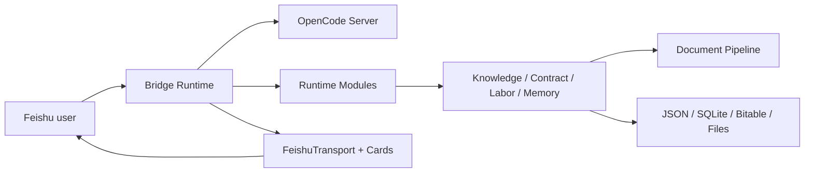

# Feishu OpenCode Bridge

[](https://nodejs.org/)
[](https://www.typescriptlang.org/)
[](https://open.feishu.cn/)
[](#developer-entry)
[](LICENSE)

[中文](README.md) | **English**

Feishu OpenCode Bridge is a local-first entry point that brings the OpenCode runtime into Feishu. It gives private chats, group chats, and topic groups controlled OpenCode session windows, process cards, permission confirmation, material handling, a legal knowledge base, and legal workbench modules.

It is not a simple "receive message, ask model, send reply" Feishu bot. Bridge owns sessions, permissions, cards, module state, and the Feishu transport boundary; OpenCode remains responsible for real agent execution.

## Data Boundary

Before sending real contracts or case materials into Bridge, read [Privacy And Data Flow](docs/privacy-and-data-flow.md).

By default, text goes through your configured OpenCode / AI provider. Contract, invoice, case, and knowledge-base indexes are written to your own local directory or Feishu Base. External OCR, memory, and Obsidian sync are controlled by explicit config switches.

## Core Capabilities

| Capability | Description |
| :-- | :-- |
| OpenCode runtime in Feishu | Session windows, model switching, process cards, permission confirmation, group and topic-group collaboration |
| Materials and knowledge base | File/URL ingestion, document parsing, legal Q&A, statute recall, optional rerank, local SQLite index |
| Legal workbench | Contract drafting, structured contract/invoice/case intake, case todos, labor dispute materials and document generation |
| State and memory | Session mappings, case checkpoints, short-term material context, optional long-term memory, optional Obsidian sync |
| Local operations | Portable startup, workspace initialization, health checks, backup/restore, cost estimates, update checks |

See [Features](docs/features.md) for details.

## Quick Start

Release users should start from the portable launcher (source developers can skip to the npm section below):

```bash
# macOS / Linux
./bridge onboard
./bridge init workspace
./bridge start
```

```cmd
:: Windows
bridge.cmd onboard
bridge.cmd init workspace
bridge.cmd start
```

After startup, return to Feishu and send:

```text
/help
```

Source contributors can use:

```bash
npm install
cp config.example.json config.json
npm run dev
```

At minimum, configure `feishu.appId`, `feishu.appSecret`, `opencode.baseUrl`, `opencode.directory`, and `storage.dataDir`. If Feishu card buttons are enabled, also configure an HTTPS public `server.publicBaseUrl` and `feishu.cardActions`.

See [Deployment](docs/deploy.md) for full setup and deployment details.

## Repository, Release Package, And User Data

The source repository contains development assets such as `src/`, `test/`, `docs/`, `scripts/`, and project configuration. `npm run release:portable` builds a runtime-only package with `dist/`, `scripts/runtime/`, launchers, the config template, README files, and LICENSE. It does not carry source code, tests, full docs, examples, or local data.

Real config and runtime state belong to the user data directory: `config.json`, `data/`, `logs/`, `.runtime/`, `turn-files/`, `artifacts/`, `outputs/`, and legacy root-level runtime files should not be committed. Read the [Local Hygiene Guide](docs/guidelines/local-hygiene.md) before cleanup or migration.

## Common Entry Points

| Entry | Purpose |
| :-- | :-- |
| `/help`, `/commands`, `/指令` | Show the Bridge command catalog in Feishu |
| `/new`, `/sessions`, `/switch <index>` | Manage OpenCode sessions in the current chat window |
| `/model use <provider/model>`, `/model reset` | Set or clear the current window model override |
| `/allow once`, `/allow always`, `/deny` | Respond to OpenCode permission requests |
| `/法律问答 <question>`, `/知识入库` | Use the legal knowledge base |
| `/合同起草开始`, `/案件录入 <info>` | Use contract and case capabilities |
| `/案件工作台`, `/完成上传` | Use the case workbench and labor dispute material flow |

See [Commands](docs/commands.md) for the full command guide.

## Documentation

| Document | Content |
| :-- | :-- |
| [Features](docs/features.md) | User capabilities, module boundaries, and typical scenarios |
| [Commands](docs/commands.md) | Feishu commands, local CLI, and common operations |
| [Docs Index](docs/README.md) | Active documentation entry points |
| [Architecture Baseline](docs/architecture-baseline.md) | Core boundaries and reviewer rules after framework freeze |
| [Config Example](config.example.json) | User configuration template |
| [Deployment](docs/deploy.md) | Local/server deployment, Caddy, health checks, and acceptance |
| [Feishu Card Spec](docs/cards/spec.md) | Active / retired card status and card admission rules |
| [Observability Event Schema](docs/observability/event-schema.md) | Runtime, transport, and module event names and fields |
| [New Feature Checklist](docs/guidelines/new-feature-checklist.md) | Architecture, test, and documentation checks for feature PRs |

## Architecture At A Glance



See [Architecture Baseline](docs/architecture-baseline.md) for the full architecture contract.

## Developer Entry

```bash
npm run typecheck
npm run lint
npm test
npm run build
```

Current full verification baseline: **78 test files · 697 tests passing**.

Development rules live in [CODEX.md](CODEX.md), [AGENTS.md](AGENTS.md), and the [New Feature Checklist](docs/guidelines/new-feature-checklist.md).

## License

[MIT](LICENSE)
