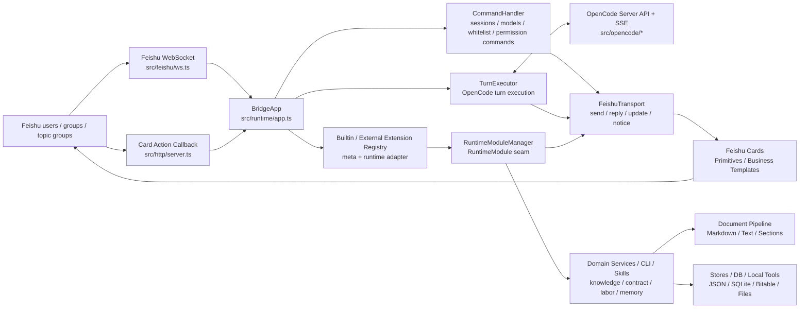
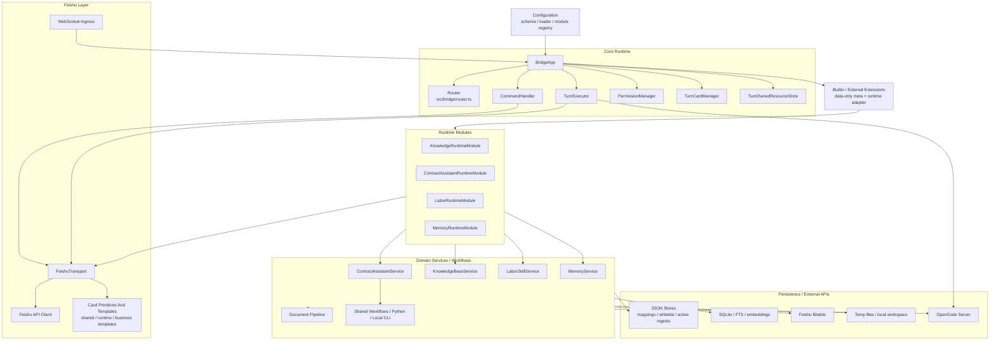

# Feishu OpenCode Bridge

[](https://nodejs.org/)
[](https://www.typescriptlang.org/)
[](https://open.feishu.cn/)
[](#%EF%B8%8F-development-commands)
[](LICENSE)

[中文](README.md) | **English**

> **Feishu OpenCode Bridge is not a normal Feishu bot.**
> It is a **Feishu-native runtime adapter** that productizes the OpenCode runtime inside Feishu, giving private chats, group chats, and topic groups session windows, process cards, permission confirmation, a legal knowledge base, contract/labor modules, and long-term memory.

## 📢 News

- **2026-04-28** · External extensions entered a constrained loading phase: public `extension-api`, startup manifest/config normalization, and external RuntimeModule adaptation, while hot reload and direct bridge-internal imports remain unsupported
- **2026-04-27** · Built-in business extensions split into data-only meta and runtime extensions, tightening the boundaries for config, command declarations, business card templates, and RuntimeModule creation
- **2026-04-24** · All open issues except the paused permission-button callback line have been closed, and the project moved into maintainer cleanup before the next release
- **2026-04-23** · Extension boundaries were tightened: configuration started using a module registry, file parsing converged on `document-pipeline`, and business cards started moving toward template runtime
- **2026-04-19** · Post-freeze backlog cleared, the `TurnExecutor` settlement controller landed, and the project moved into regular maintenance
- **2026-04-10** · Framework freeze accepted; [architecture baseline](docs/architecture-baseline.md) and [new feature checklist](docs/guidelines/new-feature-checklist.md) became PR entry gates
- **2026-03** · Runtime Module abstraction completed; knowledge, contract, labor, and memory modules converged on a shared seam
- **2026-02** · `FeishuTransport` became the single Feishu-side delivery boundary, and cards were split into family files

<details>
<summary>Earlier milestones</summary>

- Formatter was split from one large file into five families: `shared-primitives`, `runtime-cards`, `knowledge-cards`, `labor-cards`, and `contract-cards`
- OpenCode turn execution was split into `prepareTurnExecution` and `handlePermissionAskedEvent`
- Contract assistant, labor analysis, knowledge CLI, and Bitable mirror capabilities shipped
- Long-term memory integrated SQLite / FTS5 and Obsidian sync

</details>

## 💡 Core Capabilities

- **Session windows**: bind, switch, close, delete, and rename sessions across private chats, group chats, and topic groups
- **Process cards**: long-running OpenCode turns update Feishu cards with status, tool calls, and final replies
- **Permission confirmation**: OpenCode permission requests use `/allow` and `/deny` text commands as the stable path; button callbacks remain a paused follow-up line
- **Group collaboration**: whitelist binding keeps group collaboration usable without repeated `@bot` mentions
- **Knowledge base**: legal knowledge search, batch file ingestion, URL ingestion, unified document parsing, and local CLI diagnostics
- **Contract assistant**: contract drafting, case create/update flows, todos, and reminder management
- **Labor analysis**: collect labor dispute materials and produce structured analysis output
- **Long-term memory**: optional memory extraction, retrieval, SQLite / FTS5 storage, and Obsidian sync
- **Startup diagnostics**: preflight checks config, Feishu, OpenCode, providers, and callback settings before startup

## 🧭 Why This Is Not A Normal Bot

A normal bot usually receives messages and returns LLM replies. This project embeds OpenCode runtime capabilities into Feishu with stable operational boundaries:

- The bridge owns runtime commands such as `/new`, `/sessions`, `/switch`, and `/status`
- OpenCode-native commands continue to work through passthrough
- Business capabilities extend through the constrained `extension-api`, data-only extension meta, runtime extensions, Runtime Modules, CLI, skills, and shared workflows instead of growing the `core` runtime
- Feishu send, reply, update, and notice calls converge on `FeishuTransport`, shared card primitives, and business card templates
- Common files pass through `document-pipeline` into Markdown / plain text / sections before being reused by the knowledge base, contract materials, and evidence extraction
- New features must expand inside the frozen seams and must not bypass core boundaries casually

## 🏗️ Architecture

### Request Flow



### Layered View



## ✨ Capability Showcase

| Session Windows | Process Cards | Permission Confirmation | Knowledge Ingestion |
| :-- | :-- | :-- | :-- |
| Private chats, group chats, and topic groups bind independently, and switching does not lose context | Cards update in place, tool calls unfold progressively, and final replies land where the work happened | Sensitive actions use `/allow` and `/deny` text confirmation while button callbacks remain paused | Drop files into chat, paste URLs, or batch ingest documents with visible progress cards |
| `/new` · `/switch` · `/sessions` | Live tool calls + final reply | `/allow` · `/deny` | Files · URLs · batch |

| Contract Assistant | Labor Analysis | Long-Term Memory | Startup Diagnostics |
| :-- | :-- | :-- | :-- |
| From contract drafting to case tracking, todos and reminders can be pushed by schedule | Collect salary, attendance, and agreement materials, then produce analysis and workbench materials | Retrieve by conversation or topic, with optional Obsidian sync | Check Feishu, OpenCode, and callbacks before runtime starts, and fail loudly when something is missing |
| Drafting · cases · todos · reminders | Materials · timeline · ledger | SQLite + FTS5 + Obsidian | `npm run doctor` |

> Screenshots and GIFs are still being added. For now, run `npm run dev` and send the example commands in Feishu to reproduce the card experience.

## 🚀 Quick Start

```bash
# 1. Install dependencies
npm install

# 2. Prepare config
cp config.example.json config.json

# 3. Start OpenCode
opencode serve

# 4. Start the bridge
npm run dev

# 5. Run diagnostics
npm run doctor
```

At minimum, configure `feishu.appId`, `feishu.appSecret`, `opencode.baseUrl`, `opencode.directory`, and `storage.dataDir`.
If Feishu card buttons are enabled, also configure `server.publicBaseUrl` and `feishu.cardActions`.

## 📖 Common Commands

Quick reference:

- `/new` · `/status` · `/sessions` · `/switch <index>` — session control
- `/allow once` · `/allow always` · `/deny` — permission confirmation
- `/法律咨询 <question>` · `/kb-query <question>` — knowledge base query
- `/合同起草开始` · `/案件录入 <case info>` — contract assistant
- `/劳动分析` — labor dispute analysis

<details>
<summary>Show all commands</summary>

### Runtime Control

- `/new`: create a new session
- `/status`: show the current window status
- `/sessions`: list sessions
- `/switch <index>`: switch sessions
- `/rename <title>`: rename the current session
- `/close`, `/delete`: close or delete sessions
- `/abort`: abort the current turn
- `/models`, `/models <provider>`: list available models

### Group Collaboration

- `/who`: show the current group binding state
- `/leave`: remove the current user's group binding

### Permission Confirmation

- `/allow once`
- `/allow always`
- `/deny`

### Knowledge Base

- `/法律咨询开始`
- `/法律咨询结束`
- `/法律咨询 <question>`
- `/kb-query <question>`
- `/知识入库`
- `/kb-ingest-start`
- `/kb-ingest-end`

### Contract And Case

- `/合同起草开始`
- `/合同起草结束`
- `/案件录入 <case info>`
- `/案件更新 <update>`
- `/案件待办`
- `/案件提醒`
- `/添加案件提醒 <reminder>`

### Labor Analysis

- `/劳动分析`
- `/劳动分析结束`

Slash commands not owned by the bridge are passed through to OpenCode, for example `/model use ...`, `/model reset`, `/review`, and `/init`.

</details>

## 🧰 Knowledge Base CLI

The local knowledge base provides fast CLI paths:

```bash
npm run --silent kb -- query --question "What is the maximum probation period?"
npm run --silent kb -- ingest file --path "/absolute/path/to/file.pdf"
npm run --silent kb -- ingest url --url "https://example.com/article"
npm run --silent kb -- doctor
```

## ⚙️ Configuration

Use [config.example.json](config.example.json) as the template. Main config sections:

| Section | Purpose |
| :-- | :-- |
| `feishu` | Feishu app, bot identity, WebSocket, card callbacks, and behavior flags |
| `server` | HTTP listen address, health check, and public callback URL |
| `opencode` | OpenCode service URL and working directory |
| `storage` | Session mappings, whitelist, logs, and business state directories |
| `bridge` | Queueing, session mode, timeout, and system state injection |
| `memory` | Long-term memory switches, storage, and sync settings |
| `extensions["knowledge-base"]` | Knowledge base switches, ingestion, retrieval, unified document parsing, local DB, and Bitable settings |
| `extensions["contract-assistant"]` | Contract, case, invoice, and reminder capabilities |
| `extensions["labor-skill"]` | Labor analysis material collection and output settings |
| `extensions["<external-extension>"]` | External extension-owned config blocks normalized by configDefinition declarations from extension meta |

Use `extensions["extension-id"]` as the recommended user-facing config namespace. Legacy top-level `knowledgeBase`, `contractAssistant`, and `laborSkill` fields remain permanently compatible.
Runtime output is unchanged and still normalizes into `config.knowledgeBase`, `config.contractAssistant`, and `config.laborSkill`.
When namespace and legacy fields both exist, namespace wins and the loader emits a warning. Unknown namespace ids remain under `config.extensions`.
`memory` still lives in the central schema/loader for now and can migrate with the same pattern later.
Builtin extension `id` values map explicitly to config blocks through data-only meta `configKey`, for example `contract-assistant -> contractAssistant`; the runtime does not guess config keys from strings.
`extension.meta.ts` only carries static declarations such as config, commands, and card templates; `extension.ts` owns runtime module creation.
External extensions may only import public contracts from `src/extension-api/`. At startup, the bridge scans `BRIDGE_EXTENSIONS_DIR` or `${BRIDGE_HOME:-.}/extensions`; failed extensions are downgraded to warnings.

## 🛠️ Development Commands

```bash
npm run typecheck
npm run lint
npm test
npm run build
npm run dev
npm run dev:once
```

Current full verification baseline: **65 test files · 499 tests passing**

## 📂 Project Layout

```text
src/
  bridge/              # router, queue, turn state, watchdog, module interface
  config/              # zod schema, config loader, and module config registry
  document-pipeline/   # common files to Markdown / plain text / sections
  extension-api/       # public types, declaration helpers, and constrained ports for external extensions
  extensions/          # builtin extension data-only meta, runtime registry, command declarations, and template aggregation
  feishu/              # Feishu API, WebSocket ingress, card primitives and templates
  http/                # healthz and card action callback server
  runtime/             # BridgeApp, command handler, turn executor, short-term message context, preflight
  knowledge/           # legal knowledge base, parser, local CLI, SQLite mirror
  contract-assistant/  # contract drafting, case updates, reminders
  labor/               # labor dispute material collection and analysis
  memory/              # long-term memory, retrievers, embeddings, Obsidian sync
  opencode/            # OpenCode client and event stream
  store/               # JSON stores for mappings, whitelist, active ingests
  workflows/           # shared evidence, timeline, workbench, and ledger workflows
scripts/               # grouped runtime, checks, kb, wrappers, and Python scripts
docs/                  # architecture, deployment, modules, observability, and archive docs
examples/              # external extension examples and minimal loading fixtures
test/                  # Vitest unit and integration tests
```

## 📚 Documentation

- [Architecture baseline](docs/architecture-baseline.md)
- [New feature checklist](docs/guidelines/new-feature-checklist.md)
- [Feishu Markdown rules](docs/feishu-markdown.md)
- [Deployment](docs/deploy.md)
- [Observability event schema](docs/observability/event-schema.md)
- [Knowledge base design](docs/modules/knowledge-base.md)
- [Labor Skill workflow layering](docs/modules/labor-skill-workflows.md)
- [Formatter migration record](docs/archive/design-history/formatter-migration.md)
- [Framework freeze acceptance](docs/archive/qa-and-submission/freeze-acceptance.md)

## 🚢 Deployment

Single-host topology:

```text
Feishu <-> HTTPS / Caddy <-> Bridge HTTP + WebSocket <-> OpenCode Server
```

References:

- [docs/deploy.md](docs/deploy.md)
- [ops/Caddyfile](ops/Caddyfile)
- [.env.example](.env.example)

Health check `GET /healthz` · default card callback path `/webhook/card`

## 🤝 Contributing

The framework has been frozen. Future feature work should follow these rules:

- Prefer adding features inside Runtime Module / Service / Transport seams
- Built-in business capabilities should split `extension.meta.ts` from `extension.ts`: meta declares `id`, `configKey`, commands, config, and business templates, while runtime extensions only create modules
- External extensions may only depend on `src/extension-api/` and must not import `src/runtime/**`, `src/bridge/**`, `src/feishu/**`, `src/store/**`, or business implementations directly. They are still trusted startup-time code, not hot-reloaded or sandboxed plugins.
- Do not add business-specific branches to `src/runtime/app.ts`, `src/runtime/turn-executor.ts`, or `src/bridge/router.ts` unless the architecture baseline is updated first
- Prefer shared card primitives and business templates for new cards instead of growing `formatter.ts`
- Prefer CLI / skill / shared workflow boundaries for business rules, prompts, and reusable capabilities instead of hard-coding them into bridge core
- Add Chinese file header comments to important new code files using the existing `职责 / 关注点` template
- Reuse shared state persistence infrastructure instead of copying timer + JSON persist logic
- Include the [new-feature-checklist](docs/guidelines/new-feature-checklist.md) self-check in PR descriptions

## ⭐ Star History

[](https://star-history.com/#Clukay-Fun/feishu-opencode-bridge&Date)

## License

[MIT](LICENSE)
