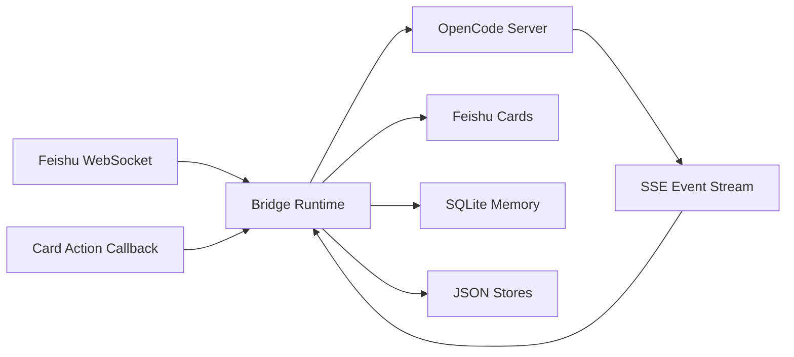

# Feishu OpenCode Bridge

[中文](README.zh-CN.md) | English

[](https://github.com/Clukay-Fun/feishu-opencode-bridge/actions/workflows/ci.yml)
[](https://nodejs.org/)
[](https://www.typescriptlang.org/)
[](LICENSE)

Turn Feishu chats into persistent, session-aware OpenCode workspaces.

Feishu OpenCode Bridge is a standalone TypeScript service that connects Feishu conversations to a local [OpenCode](https://opencode.ai) server. It manages sessions, renders streaming process cards, handles permission approval via interactive buttons, supports group collaboration, and maintains long-term user memory — all inside Feishu.

<!-- Screenshots: replace placeholders with actual images -->
<!--
<p align="center">
  
  
  
</p>
-->

## Key Features

- **Session Windows** — Independent session binding for private chats, group chats, and topic groups, with `single` and `multi` session modes.
- **Streaming Process Cards** — Real-time in-place card updates while OpenCode runs. Completed output is rendered as semantically split Markdown blocks for better readability.
- **Permission Buttons** — Approve or deny OpenCode tool calls directly from Feishu card buttons. Supports allow-once, allow-always, and deny.
- **Group Collaboration** — Mention `@bot` once to bind the whitelist. Subsequent messages work without mentioning. Manage with `/who` and `/leave`.
- **Long-term Memory** — Automatically extracts user facts, stores embeddings in SQLite, recalls relevant context across sessions, and can sync an Obsidian `profile.md`.
- **Fault Tolerance** — SSE reconnection with exponential backoff, Feishu API retry with token caching, rate limiting, and graceful process card fallback.
- **Command Passthrough** — Commands the bridge does not own continue to flow through to OpenCode.
- **Operational Guardrails** — Startup preflight checks Feishu auth, OpenCode health, providers, storage, and callback configuration before serving traffic.

## Architecture



## Quick Start

### Prerequisites

- Node.js 20+
- A Feishu custom app with bot capability ([create one here](https://open.feishu.cn/app))
- A running OpenCode server (`opencode serve`)
- (Optional) Public HTTPS endpoint for permission button callbacks

### Setup

```bash
git clone https://github.com/Clukay-Fun/feishu-opencode-bridge.git
cd feishu-opencode-bridge
npm install
cp config.example.json config.json
# Edit config.json — fill in feishu.appId, feishu.appSecret, and opencode.baseUrl
```

### Run

```bash
opencode serve          # Start OpenCode first
npm run dev             # Then start the bridge
```

The bridge runs a startup preflight that checks Feishu auth, OpenCode connectivity, storage directories, and callback config. If anything fails, it exits immediately with a clear error.

## Commands

| Command | Description |
|---------|-------------|
| `/new` | Create a new session |
| `/status` | Show current session and system state |
| `/abort` | Abort the running task |
| `/sessions` | List all sessions |
| `/switch <n>` | Switch to session by index |
| `/model` | Show the current model and active override |
| `/model <provider>` | Show models under a provider |
| `/who` | Show group binding status |
| `/leave` | Unbind from group whitelist |
| `/close` | Close the current session |
| `/close all` | Close every session in the current window |
| `/close <start-end>` | Close a session range |
| `/delete` | Delete the current session |
| `/delete all confirm` | Delete all sessions in the current window |
| `/delete <index> confirm` | Delete one session by index |
| `/delete <start-end> confirm` | Delete a session range |
| `/allow once` | Allow the current permission request |
| `/allow always` | Always allow this permission |
| `/deny` | Deny the permission request |

Any other `/` command is passed through to OpenCode (e.g. `/model use ...`, `/model reset`, `/review`, `/init`).

## Configuration

See [`config.example.json`](config.example.json) for the full reference.

| Section | What it controls |
|---------|-----------------|
| `feishu` | App credentials, bot behavior, card action security |
| `opencode` | OpenCode server URL and target worktree |
| `server` | HTTP listen address and public callback URL |
| `bridge` | Queue concurrency, session mode, timeouts |
| `storage` | JSON store and SQLite paths |
| `logging` | Log level, console/transcript toggles, daily rotation |
| `memory` | Memory extraction, embedding, recall, and optional Obsidian sync |

### Permission Button Callback

To enable interactive permission buttons, expose the bridge HTTP server behind HTTPS and configure:

```json
{
  "server": {
    "host": "127.0.0.1",
    "port": 3000,
    "publicBaseUrl": "https://bridge.example.com/"
  },
  "feishu": {
    "cardActions": {
      "enabled": true,
      "path": "/webhook/card",
      "verificationToken": "your-token",
      "encryptKey": "your-encrypt-key"
    }
  }
}
```

If Feishu event encryption is enabled, set `encryptKey` as well.

## Startup Preflight

On startup the bridge checks:

- storage and log directories are writable
- Feishu tenant token can be fetched
- OpenCode health is good
- OpenCode worktree matches bridge config
- provider list is reachable
- card callback config is complete when button mode is enabled

If any of these checks fail, the bridge exits early instead of half-starting.
## Deployment

See [docs/deploy.md](docs/deploy.md) for single-host deployment with Caddy.

```bash
npm run build
node dist/index.js
```

Docker:

```bash
docker build -t feishu-opencode-bridge .
docker run -v ./config.json:/app/config.json feishu-opencode-bridge
```

Health check: `GET /healthz`

## Development

```bash
npm run typecheck       # Type check
npm run lint            # Lint
npm test                # Run all tests
npm run dev             # Start with watch mode
```

## Project Layout

```
src/
  bridge/       Queue, routing, pending interaction state
  config/       Config schema (Zod) and loader
  feishu/       Feishu API client, card formatter, WebSocket ingress
  http/         Callback server and health endpoint
  logging/      Structured logger with daily rotation
  memory/       Memory extraction, embedding, SQLite storage, Obsidian sync
  opencode/     OpenCode HTTP client and SSE event stream
  runtime/      Bridge orchestration, commands, turn execution, permission manager
  store/        JSON-backed session and whitelist stores
```

## License

[Apache License 2.0](LICENSE)
