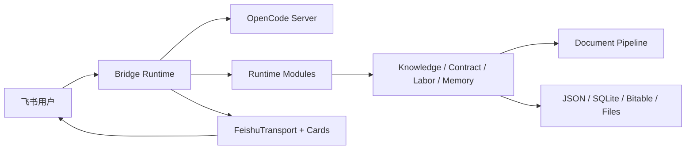

# Feishu OpenCode Bridge

[](https://nodejs.org/)
[](https://www.typescriptlang.org/)
[](https://open.feishu.cn/)
[](#开发者入口)
[](LICENSE)

**中文** | [English](README.en.md)

Feishu OpenCode Bridge 是把 OpenCode 运行时接入飞书的本地优先工作入口。它让私聊、群聊和话题群拥有可控的 OpenCode 会话窗口、过程卡片、权限确认、材料处理、法律知识库和法律业务工作台。

它不是只负责“收消息、问模型、回消息”的普通飞书机器人。Bridge 自己管理会话、权限、卡片、模块状态和飞书传输边界；OpenCode 仍负责真实 agent 执行。

## 数据边界

真实合同、案件材料进入 Bridge 前，建议先看 [数据流向与隐私说明](docs/privacy-and-data-flow.md)。

默认边界是：文本会进入你配置的 OpenCode / AI provider；合同、发票、案件和知识库索引写入你自己的本地目录或飞书 Base。外部 OCR、记忆、Obsidian 同步等能力都由配置开关控制。

## 核心能力

| 能力 | 说明 |
| :-- | :-- |
| OpenCode 飞书运行时 | 会话窗口、模型切换、过程卡片、权限确认、群聊和话题群协作 |
| 材料处理与知识库 | 文件/URL 入库、文档解析、法律问答、法条召回、可选 rerank、本地 SQLite 索引 |
| 法律业务工作台 | 合同起草、合同/发票/案件结构化录入、案件待办、劳动争议材料整理与文书生成 |
| 状态与记忆 | 会话映射、案件断点、短期材料上下文、可选长期记忆、可选 Obsidian 同步 |
| 本地运维 | portable 启动、工作区初始化、健康检查、备份恢复、成本估算、更新检查 |

更多功能说明见 [功能说明](docs/features.md)。

## 快速开始

Release 包用户优先使用 portable 入口（源码开发者请直接跳到下方 npm 段）：

```bash
# macOS / Linux
./bridge onboard
./bridge init workspace
./bridge start
```

```cmd
:: Windows
bridge.cmd onboard
bridge.cmd init workspace
bridge.cmd start
```

启动后回到飞书发送：

```text
/help
```

源码开发者可以使用：

```bash
npm install
cp config.example.json config.json
npm run dev
```

至少需要配置 `feishu.appId`、`feishu.appSecret`、`opencode.baseUrl`、`opencode.directory` 和 `storage.dataDir`。如果启用飞书卡片按钮，还需要 HTTPS 公网 `server.publicBaseUrl` 与 `feishu.cardActions`。

完整部署和初始化说明见 [部署说明](docs/deploy.md)。

## 仓库、发布包与用户数据

源码仓库包含开发所需的 `src/`、`test/`、`docs/`、`scripts/` 和工程配置。`npm run release:portable` 生成的发布包只包含 `dist/`、`scripts/runtime/`、启动器、配置样例、README 和 LICENSE，不携带源码、测试、完整文档、示例或本地数据。

真实配置和运行状态属于用户数据目录：`config.json`、`data/`、`logs/`、`.runtime/`、`turn-files/`、`artifacts/`、`outputs/` 以及历史根目录 runtime 文件都不应提交。清理或迁移前请先看 [本地卫生清理指南](docs/guidelines/local-hygiene.md)。

## 常用入口

| 入口 | 用途 |
| :-- | :-- |
| `/help`、`/commands`、`/指令` | 在飞书里查看 Bridge 指令总览 |
| `/new`、`/sessions`、`/switch <编号>` | 管理当前聊天窗口的 OpenCode 会话 |
| `/model use <provider/model>`、`/model reset` | 切换或恢复当前窗口模型 |
| `/allow once`、`/allow always`、`/deny` | 处理 OpenCode 权限请求 |
| `/法律问答 <问题>`、`/知识入库` | 使用法律知识库 |
| `/合同起草开始`、`/案件录入 <信息>` | 使用合同与案件能力 |
| `/案件工作台`、`/完成上传` | 使用案件工作台和劳动争议材料流程 |

完整命令说明见 [命令手册](docs/commands.md)。

## 文档导航

| 文档 | 内容 |
| :-- | :-- |
| [功能说明](docs/features.md) | 用户能力、模块边界和典型使用场景 |
| [命令手册](docs/commands.md) | 飞书命令、本地 CLI 和常见操作 |
| [文档索引](docs/README.md) | 当前活跃文档入口 |
| [架构基线](docs/architecture-baseline.md) | framework freeze 后的核心边界和 reviewer 规则 |
| [配置样例](config.example.json) | 用户配置模板 |
| [部署说明](docs/deploy.md) | 本地、服务器、Caddy、健康检查和验收步骤 |
| [飞书卡片规范](docs/cards/spec.md) | 卡片 active / retired 状态和准入规则 |
| [可观测性事件规范](docs/observability/event-schema.md) | runtime、transport、module 事件命名和字段 |
| [新功能自检清单](docs/guidelines/new-feature-checklist.md) | 新功能 PR 的架构、测试、文档检查 |

## 架构概览



详细架构见 [架构基线](docs/architecture-baseline.md)。

## 开发者入口

```bash
npm run typecheck
npm run lint
npm test
npm run build
```

当前完整验证基线：**78 test files · 697 tests passing**。

开发约束见 [CODEX.md](CODEX.md)、[AGENTS.md](AGENTS.md) 和 [新功能自检清单](docs/guidelines/new-feature-checklist.md)。

## License

[MIT](LICENSE)
