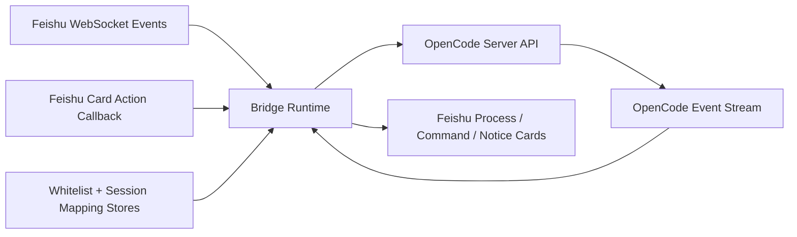

# Feishu OpenCode Bridge

[](https://nodejs.org/)
[](https://www.typescriptlang.org/)
[](https://open.feishu.cn/)

Feishu OpenCode Bridge is a Feishu-native runtime adapter for OpenCode.

It turns Feishu chats into session-aware OpenCode workspaces, keeps process updates inside interactive cards, handles permission confirmation, and preserves a clear boundary between bridge-owned runtime control and passthrough OpenCode commands.

## Why This Is Not A Normal Bot

This project is not trying to be a generic chat bot.

It is a bridge layer that gives OpenCode a stable runtime surface inside Feishu:

- session-aware windows for `p2p`, `group`, and `topic_group`
- bridge-owned runtime commands such as `/new`, `/status`, `/sessions`, `/switch`
- process cards that update in place while a task is running
- real permission buttons backed by Feishu card actions
- group whitelist binding so collaboration can continue without repeated `@bot`

## Features

- Interactive Process Card with in-place updates for running turns
- Bridge-owned command cards for session and group binding flows
- True permission buttons with text-command fallback
- Group whitelist binding with `/who` and `/leave`
- `single` and `multi` session modes per window type
- Optional long-term memory recall, embedding-based retrieval, and Obsidian profile sync
- Slash command passthrough to OpenCode for commands the bridge does not own
- Startup preflight for Feishu auth, OpenCode health, providers, and callback config
- JSON-backed stores for session mappings and group bindings
- Markdown output rules documented in [docs/feishu-markdown.md](/Users/clukay/Program/feishu-opencode-bridge/docs/feishu-markdown.md)

## Architecture



## Demo Flow

The fixed public demo script lives in [docs/demo-script.md](/Users/clukay/Program/feishu-opencode-bridge/docs/demo-script.md).

It covers:

1. Private chat developer assistant flow
2. Group chat binding and no-mention continuation
3. Permission button flow
4. `lark-cli`-driven Feishu workflow actions

## Output Rules

- Markdown rules: [docs/feishu-markdown.md](/Users/clukay/Program/feishu-opencode-bridge/docs/feishu-markdown.md)
- `Plain Post` is only for passthrough text output, ultra-short confirmations, and card fallback
- Bridge-owned commands, structured lists, and system notices should use cards instead

## Requirements

- Node.js 20+
- A Feishu app with bot capability
- A running OpenCode server
- Public HTTPS callback if you want real permission buttons

## Quick Start

Install dependencies:

```bash
npm install
```

Start OpenCode first:

```bash
opencode serve
```

Then start the bridge:

```bash
npm run dev
```

## Configuration

Use [config.example.json](/Users/clukay/Program/feishu-opencode-bridge/config.example.json) as the baseline.

Important sections:

- `feishu`
  bot identity, behavior flags, and card action security settings
- `opencode`
  OpenCode base URL and target worktree
- `server`
  local HTTP listen address and public callback base URL
- `storage`
  JSON persistence location
- `bridge`
  queueing, session mode, and timeout behavior
- `memory`
  optional long-term memory storage and retrieval settings

### Button Callback Config

To enable real permission buttons:

```json
{
  "server": {
    "host": "127.0.0.1",
    "port": 3000,
    "publicBaseUrl": "https://bridge.example.com/"
  },
  "feishu": {
    "cardActions": {
      "enabled": true,
      "path": "/webhook/card",
      "verificationToken": "your-token",
      "encryptKey": ""
    }
  }
}
```

If Feishu event encryption is enabled, set `encryptKey` as well.

## Commands

Bridge-owned commands:

- `/new`
- `/status`
- `/abort`
- `/models`
- `/sessions`
- `/sessions <index>`
- `/switch <index>`
- `/who`
- `/leave`
- `/allow once`
- `/allow always`
- `/deny`

Any other slash command is forwarded to OpenCode.

That means OpenCode-native commands such as:

- `/model use ...`
- `/review`
- `/init`

can continue to work through passthrough, as long as your OpenCode runtime supports them.

## Startup Preflight

On startup the bridge checks:

- storage and log directories are writable
- Feishu tenant token can be fetched
- OpenCode health is good
- OpenCode worktree matches bridge config
- provider list is reachable
- card callback config is complete when button mode is enabled

If any of these checks fail, the bridge exits early instead of half-starting.

## Deployment

Single-host deployment guidance lives in [docs/deploy.md](/Users/clukay/Program/feishu-opencode-bridge/docs/deploy.md).

Included assets:

- [ops/Caddyfile](/Users/clukay/Program/feishu-opencode-bridge/ops/Caddyfile)
- [.env.example](/Users/clukay/Program/feishu-opencode-bridge/.env.example)

Health check endpoint:

```text
GET /healthz
```

Card action callback default path:

```text
/webhook/card
```

## Development

Useful commands:

```bash
npm run typecheck
npm test
npm run lint
npm run dev
npm run dev:once
```

## Project Layout

- `src/bridge/`
  queueing, routing, pending interaction state, watchdog
- `src/config/`
  config schema and loader
- `src/feishu/`
  API client, formatter, WebSocket ingress
- `src/http/`
  callback server and health endpoint
- `src/opencode/`
  OpenCode HTTP client and event stream
- `src/runtime/`
  bridge orchestration and startup preflight
- `src/store/`
  JSON-backed stores

## Notes

- This repo currently targets a public demo / submission build, not a full team-production platform
- Linux x64 validation remains a release gate, especially if any native dependency is introduced later
