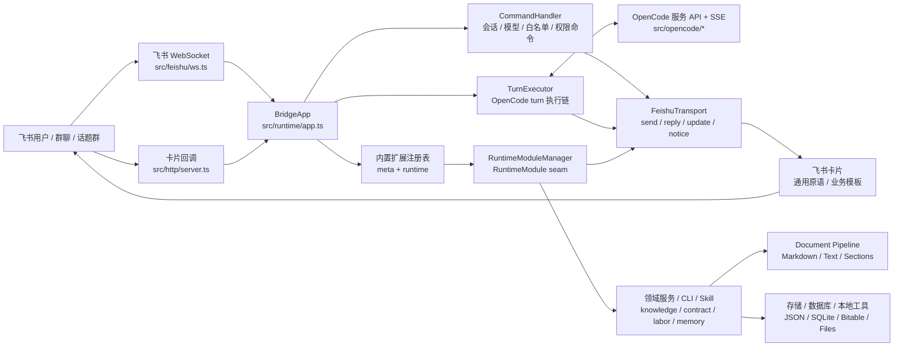
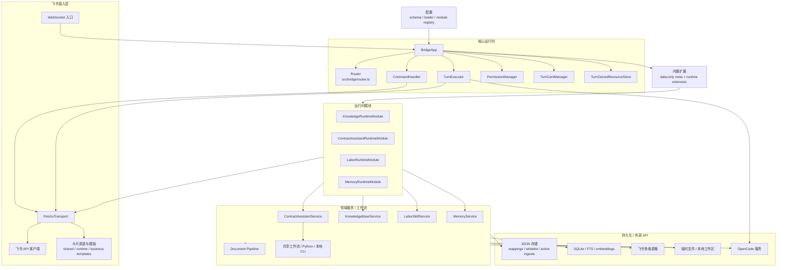

# Feishu OpenCode Bridge

[](https://nodejs.org/)
[](https://www.typescriptlang.org/)
[](https://open.feishu.cn/)
[](#%EF%B8%8F-开发命令)
[](LICENSE)

**中文** | [英文版](README.en.md)

> **Feishu OpenCode Bridge 不是一个普通的飞书机器人。**
> 它是把 OpenCode 运行时产品化到飞书里的 **Feishu-native runtime adapter**——让私聊、群聊、话题群都拥有会话窗口、过程卡片、权限确认、知识库、合同/劳动业务模块和长期记忆，真正成为 OpenCode 的工作入口。

## 📢 项目动态

- **2026-04-27** · 内置业务扩展拆分为 data-only meta 与 runtime extension，配置、命令声明、业务卡片模板和 RuntimeModule 创建边界进一步收紧
- **2026-04-24** · 除权限按钮回调外的 open issue 已完成收口，项目进入框架维护与发布前整理阶段
- **2026-04-23** · 业务扩展边界继续收紧：配置引入模块注册表，文件解析收敛到 `document-pipeline`，业务卡片开始向模板化运行时迁移
- **2026-04-19** · 冻结后 backlog 全部清零，`TurnExecutor` settlement 控制器落地，进入日常维护节奏
- **2026-04-10** · 框架冻结验收通过，[架构基线](docs/architecture-baseline.md) 与 [新功能自检清单](docs/guidelines/new-feature-checklist.md) 成为 PR 准入标准
- **2026-03** · Runtime Module 抽象完成，知识 / 合同 / 劳动 / 记忆四大模块全部收敛到统一 seam
- **2026-02** · `FeishuTransport` 成为飞书侧唯一出口，卡片拆分为独立 family 文件

<details>
<summary>更早的里程碑</summary>

- Formatter 从单体文件拆分为 `shared-primitives` + `runtime-cards` + `knowledge-cards` + `labor-cards` + `contract-cards` 五个家族
- OpenCode turn 执行链抽象出 `prepareTurnExecution` / `handlePermissionAskedEvent`
- 合同助手、劳动分析、知识库 CLI 与 Bitable 镜像能力上线
- 长期记忆接入 SQLite / FTS5 + Obsidian 同步

</details>

## 💡 核心能力

- **会话窗口**：支持私聊、群聊、话题群的 session 绑定、切换、关闭、重命名
- **过程卡片**：运行中的 OpenCode turn 通过飞书卡片持续更新状态、工具调用和最终回复
- **权限确认**：OpenCode 权限请求以 `/allow`、`/deny` 文本命令作为稳定路径，按钮回调链路保留为后续验证项
- **群聊协作**：通过白名单绑定支持群内免重复 `@bot` 的协作流
- **知识库**：支持法律知识查询、批量文件入库、URL 入库、统一文档解析和本地 CLI 诊断
- **合同助手**：支持合同起草、案件录入/更新、待办和提醒管理
- **劳动分析**：支持劳动争议材料收集、整理和分析输出
- **长期记忆**：可选的记忆提取、检索、SQLite / FTS5 存储和 Obsidian 同步
- **启动前诊断**：preflight 会在启动时检查配置、Feishu、OpenCode、provider 和 callback 设置

## 🧭 为什么不是普通机器人

普通机器人通常只做消息收发和 LLM 回复。本项目的核心价值是把 OpenCode 的运行时能力稳定地嵌入飞书：

- bridge 自己拥有 `/new`、`/sessions`、`/switch`、`/status` 等运行时控制面
- OpenCode 原生命令继续通过 passthrough 工作
- 业务能力通过 data-only extension meta、runtime extension、Runtime Module、CLI、skill 和共享 workflow 扩展，而不是继续把 `core` 写成巨型分支
- 飞书发送、回复、更新、notice 收敛到 `FeishuTransport`、通用卡片原语和业务卡片模板入口
- 常见文件先经 `document-pipeline` 转换为 Markdown / 纯文本 / sections，再供知识库、合同材料和证据抽取复用
- 新功能必须在冻结后的 seam 内扩展，不能随意绕过核心边界

## 🏗️ 架构

### 请求流



### 分层视图



## ✨ 能力展示

| 会话窗口 | 过程卡片 | 权限确认 | 知识入库 |
| :-- | :-- | :-- | :-- |
| 私聊 / 群聊 / 话题群各自独立绑定，切换不丢上下文 | 卡片原地滚动更新，工具调用逐步展开，最终回复就地落地 | 敏感操作通过 `/allow` `/deny` 文本确认，按钮链路暂缓 | 拖文件进聊天、粘 URL 或批量入库，进度卡片全程可见 |
| `/new` · `/switch` · `/sessions` | 实时工具调用 + 最终回复 | `/allow` · `/deny` | 文件 · URL · 批量 |

| 合同助手 | 劳动分析 | 长期记忆 | 启动诊断 |
| :-- | :-- | :-- | :-- |
| 从合同起草到案件追踪，待办与提醒按日推送 | 收齐工资 / 考勤 / 协议，产出争议分析与工作台材料 | 按会话 / 主题检索，支持与 Obsidian 双向同步 | 启动前自检飞书 / OpenCode / 回调，缺什么报什么 |
| 起草 · 案件 · 待办 · 提醒 | 材料收集 · 时间线 · 台账 | SQLite + FTS5 + Obsidian | `npm run doctor` |

> 截图与 GIF 正在补充中。当前版本运行 `npm run dev` 并在飞书侧发送示例命令即可复现上述卡片体验。

## 🚀 快速开始

```bash
# 1. 安装依赖
npm install

# 2. 准备配置
cp config.example.json config.json

# 3. 启动 OpenCode
opencode serve

# 4. 启动 Bridge
npm run dev

# 5. 运行诊断
npm run doctor
```

至少需要配置 `feishu.appId`、`feishu.appSecret`、`opencode.baseUrl`、`opencode.directory`、`storage.dataDir`。
如果启用飞书卡片按钮，还需要配置 `server.publicBaseUrl` 和 `feishu.cardActions`。

## 📖 常用命令

速查：

- `/new` · `/status` · `/sessions` · `/switch <编号>` — 会话控制
- `/allow once` · `/allow always` · `/deny` — 权限确认
- `/法律咨询 <问题>` · `/kb-query <问题>` — 知识库查询
- `/合同起草开始` · `/案件录入 <案件信息>` — 合同助手
- `/劳动分析` — 劳动争议分析

<details>
<summary>展开全部命令</summary>

### 运行时控制

- `/new`：创建新会话
- `/status`：查看当前窗口状态
- `/sessions`：查看会话列表
- `/switch <编号>`：切换会话
- `/rename <标题>`：重命名当前会话
- `/close`、`/delete`：关闭或删除会话
- `/abort`：中止当前任务
- `/models`、`/models <provider>`：查看模型列表

### 群聊协作

- `/who`：查看当前群绑定状态
- `/leave`：解除当前用户的群聊绑定

### 权限确认

- `/allow once`
- `/allow always`
- `/deny`

### 知识库

- `/法律咨询开始`
- `/法律咨询结束`
- `/法律咨询 <问题>`
- `/kb-query <问题>`
- `/知识入库`
- `/kb-ingest-start`
- `/kb-ingest-end`

### 合同与案件

- `/合同起草开始`
- `/合同起草结束`
- `/案件录入 <案件信息>`
- `/案件更新 <更新内容>`
- `/案件待办`
- `/案件提醒`
- `/添加案件提醒 <提醒内容>`

### 劳动分析

- `/劳动分析`
- `/劳动分析结束`

未被 bridge 接管的 slash 命令会透传给 OpenCode，例如 `/model use ...`、`/model reset`、`/review`、`/init`。

</details>

## 🧰 知识库 CLI

本地知识库提供 CLI 快速路径：

```bash
npm run --silent kb -- query --question "员工试用期最长多久？"
npm run --silent kb -- ingest file --path "/absolute/path/to/file.pdf"
npm run --silent kb -- ingest url --url "https://example.com/article"
npm run --silent kb -- doctor
```

## ⚙️ 配置说明

配置文件以 [config.example.json](config.example.json) 为模板。主要配置块：

| 配置块 | 作用 |
| :-- | :-- |
| `feishu` | 飞书应用、机器人身份、WebSocket、卡片回调和行为开关 |
| `server` | HTTP 服务监听地址、健康检查和公网回调地址 |
| `opencode` | OpenCode 服务地址和工作目录 |
| `storage` | 会话映射、白名单、日志和业务状态目录 |
| `bridge` | 队列、会话模式、超时和系统状态注入 |
| `memory` | 长期记忆开关、存储和同步设置 |
| `knowledgeBase` | 知识库开关、入库、检索、统一文档解析、本地数据库和多维表格配置 |
| `contractAssistant` | 合同、案件、发票和提醒能力配置 |
| `laborSkill` | 劳动分析材料收集和输出配置 |

`knowledgeBase`、`contractAssistant`、`laborSkill` 已通过模块配置注册表接入；`memory` 暂仍在中央 schema/loader 中，后续可按同样模式下沉。
内置扩展的 `id` 与配置块通过 data-only meta 的 `configKey` 显式映射，例如 `contract-assistant -> contractAssistant`，不依赖字符串猜测。
`extension.meta.ts` 只承载配置、命令、卡片模板等静态声明；`extension.ts` 只负责 runtime module 创建。

## 🛠️ 开发命令

```bash
npm run typecheck
npm run lint
npm test
npm run build
npm run dev
npm run dev:once
```

当前完整验证基线：**62 test files · 441 tests passing**

## 📂 项目目录

```text
src/
  bridge/              # 路由、队列、turn 状态、看门狗、模块接口
  config/              # Zod schema、配置加载与模块配置注册表
  document-pipeline/   # 常见文件到 Markdown / 纯文本 / sections 的统一解析入口
  extensions/          # 内置扩展 data-only meta、runtime registry、命令声明和模板聚合
  feishu/              # 飞书 API、WebSocket 入口、卡片原语与业务模板
  http/                # healthz 与卡片回调服务
  runtime/             # BridgeApp、命令处理、turn 执行、短期消息上下文、启动前检查
  knowledge/           # 法律知识库、解析器、本地 CLI、SQLite 镜像
  contract-assistant/  # 合同起草、案件更新、提醒
  labor/               # 劳动争议材料收集与分析
  memory/              # 长期记忆、检索器、embedding、Obsidian 同步
  opencode/            # OpenCode 客户端与事件流
  store/               # 会话映射、白名单、活跃入库等 JSON 存储
  workflows/           # 证据提取、时间线、工作台、台账等共享工作流
scripts/               # runtime、checks、kb、wrappers、python 分组脚本
docs/                  # 架构、部署、模块、可观测性、归档文档
test/                  # Vitest 单元测试与集成测试
```

## 📚 文档入口

- [架构基线](docs/architecture-baseline.md) — 冻结后的分层边界、扩展 seam 与禁止绕开的核心约束
- [新功能自检清单](docs/guidelines/new-feature-checklist.md) — 新功能进入 PR 前必须核对的架构、测试、文档与部署检查项
- [飞书 Markdown 输出规范](docs/feishu-markdown.md) — 面向飞书消息的 Markdown 输出规则和长文本排版约束
- [部署说明](docs/deploy.md) — 本地与服务器部署、环境变量、Caddy、健康检查和验收步骤
- [可观测性事件规范](docs/observability/event-schema.md) — runtime、transport、module 事件命名和字段约定
- [法律知识库方案](docs/modules/knowledge-base.md) — 知识库入库、检索、Bitable 镜像和 CLI 使用说明
- [Labor Skill 工作流分层](docs/modules/labor-skill-workflows.md) — 劳动案件 workflow、shared workflow 与专项能力边界
- [Formatter 迁移记录](docs/archive/design-history/formatter-migration.md) — 卡片 formatter 拆分的迁移背景、边界和收尾记录
- [框架冻结验收](docs/archive/qa-and-submission/freeze-acceptance.md) — 框架冻结时的验收范围、证据和后续准入要求

## 🚢 部署

单机部署拓扑：

```text
飞书 <-> HTTPS / Caddy <-> Bridge HTTP + WebSocket <-> OpenCode 服务
```

参考：

- [部署说明](docs/deploy.md)
- [Caddy 配置样例](ops/Caddyfile)
- [环境变量样例](.env.example)

健康检查 `GET /healthz` · 默认卡片回调路径 `/webhook/card`

## 🤝 贡献与开发约束

本项目已经完成框架冻结。后续功能开发请遵守：

- 新功能优先落在 Runtime Module / Service / Transport seam 内
- 内置业务能力应拆分 `extension.meta.ts` 与 `extension.ts`：meta 声明 `id`、`configKey`、commands、配置和业务模板，runtime extension 只负责 module 创建；这不是第三方插件 API，也不支持运行时热拔插
- 不要在 `src/runtime/app.ts`、`src/runtime/turn-executor.ts`、`src/bridge/router.ts` 里新增业务特定分支，除非同步更新架构基线
- 新卡片优先走通用卡片原语与业务模板，不要继续扩张 `formatter.ts`
- 业务规则、prompt 和可复用能力优先沉淀到 CLI / skill / shared workflow，不要默认写死进 bridge core
- 新增重要代码文件应写中文文件头注释，沿用 `职责 / 关注点` 模板
- 模块状态持久化复用共享基础设施，不复制 timer + JSON persist 逻辑
- PR 描述里建议附上 [新功能自检清单](docs/guidelines/new-feature-checklist.md) 的自检结果

## ⭐ Star 历史

[](https://star-history.com/#Clukay-Fun/feishu-opencode-bridge&Date)

## 许可证

[MIT](LICENSE)
