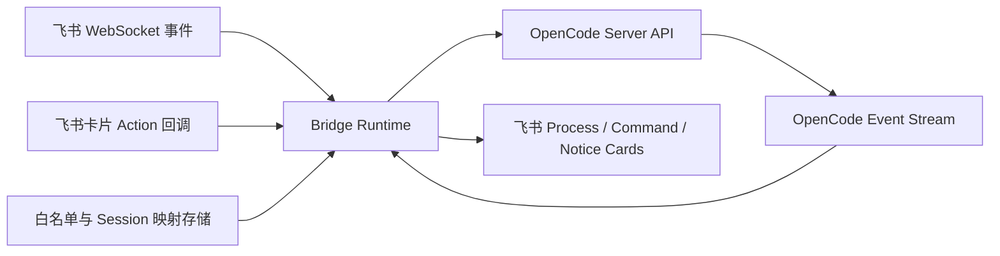

# Feishu OpenCode Bridge

[](https://nodejs.org/)
[](https://www.typescriptlang.org/)
[](https://open.feishu.cn/)

Feishu OpenCode Bridge 是一个把 OpenCode 运行时产品化到飞书里的桥接层。

它把飞书聊天窗口变成有会话、有过程卡片、有权限确认、有群聊协作边界的 OpenCode 入口，而不是一个普通的聊天机器人。

## 为什么它不是普通机器人

这个项目的目标不是“在飞书里接一个 LLM 问答机器人”。

它更像一个 Feishu-native 的 OpenCode runtime adapter：

- 在 `p2p`、`group`、`topic_group` 里维护窗口级 session
- 把 `/new`、`/status`、`/sessions`、`/switch` 这类运行时控制留在 bridge 侧
- 用 Process Card 持续更新任务处理过程
- 用真实权限按钮处理危险操作确认
- 用群级白名单绑定保证协作流畅，而不是每句都重复 `@bot`

## 功能特性

- Process Card 持续原位更新任务过程
- Command Card 承载会话管理和群聊绑定结果
- 真按钮权限流，并保留文本命令 fallback
- 群聊白名单绑定，支持 `/who` 与 `/leave`
- 按窗口类型配置 `single` / `multi` 会话模式
- 支持可选的长期记忆召回、embedding 检索，以及 Obsidian 用户画像同步
- 支持可选的法律知识库，包含 `/legal-query-start` 模式切换、`/legal-query` 单次检索、OpenCode 辅助 URL 入库和 `/kb-ingest-start` / `/kb-ingest-end` 文件入库
- 未被 bridge 接管的 slash 命令透传给 OpenCode
- 启动前 preflight，提前检查鉴权、OpenCode 健康、provider、回调配置
- 基于 JSON 的会话映射和群聊绑定持久化
- 飞书输出规范集中维护在 [docs/feishu-markdown.md](/Users/clukay/Program/feishu-opencode-bridge/docs/feishu-markdown.md)

## 架构图



## 演示脚本

固定演示脚本见 [docs/demo-script.md](/Users/clukay/Program/feishu-opencode-bridge/docs/demo-script.md)。

包含四条固定链路：

1. 私聊开发助手
2. 群聊协作
3. 权限按钮流
4. `lark-cli` 联动

## 输出规范

- Markdown 规则： [docs/feishu-markdown.md](/Users/clukay/Program/feishu-opencode-bridge/docs/feishu-markdown.md)
- `Plain Post` 只用于 passthrough 文本输出、极短确认语和卡片降级兜底
- bridge 自有命令、结构化列表、系统提示优先用卡片

## 环境要求

- Node.js 20+
- 已开启机器人能力的飞书应用
- 正在运行的 OpenCode 服务
- 若要启用真按钮权限流，需要一个公开 HTTPS 回调地址

## 快速开始

安装依赖：

```bash
npm install
```

先启动 OpenCode：

```bash
opencode serve
```

再启动 bridge：

```bash
npm run dev
```

## 配置

以 [config.example.json](/Users/clukay/Program/feishu-opencode-bridge/config.example.json) 为基线创建 `config.json`。

重点配置块：

- `feishu`
  飞书应用、行为开关、卡片 action 安全参数
- `opencode`
  OpenCode 地址与目标工作目录
- `server`
  本地 HTTP 监听地址与公网回调 base URL
- `storage`
  JSON 持久化目录
- `bridge`
  队列、会话模式、超时参数
- `memory`
  可选的长期记忆存储与召回配置
- `knowledgeBase`
  可选的法律知识库、本地 SQLite 镜像、飞书多维表格存储与文件入库配置
- `laborSkill`
  可选的劳动争议证据链分析工作流；开启时需要同时开启 `knowledgeBase`

### 知识库多维表格权限

`knowledgeBase.enabled` 为 `true` 时，bridge 会通过 `feishu.appId` / `feishu.appSecret` 配置的飞书应用读写多维表格，不会使用你个人网页登录态。

启动 bridge 前需要确认两层权限都已配置：

- 在飞书开放平台的同一个应用 ID 下，开通部署所需的多维表格记录读写权限，并发布新版本。
- 在目标多维表格里，打开 `...` -> `更多` -> `添加文档应用`，把同一个飞书应用添加为该 Base 的文档应用。

如果没有把应用添加到目标 Base，即使你本人能打开表格，启动镜像同步或入库写表也可能报 `RolePermNotAllow`。

### 真按钮权限流配置

```json
{
  "server": {
    "host": "127.0.0.1",
    "port": 3000,
    "publicBaseUrl": "https://bridge.example.com/"
  },
  "feishu": {
    "cardActions": {
      "enabled": true,
      "path": "/webhook/card",
      "verificationToken": "your-token",
      "encryptKey": ""
    }
  }
}
```

如果飞书开启了加密推送，需要同时配置 `encryptKey`。

## 支持的命令

bridge 自己接管的命令：

- `/new`
- `/status`
- `/abort`
- `/models`
- `/sessions`
- `/sessions <编号>`
- `/switch <编号>`
- `/who`
- `/leave`
- `/legal-query-start`
- `/legal-query-end`
- `/legal-query <问题>`
- `/kb-ingest-start`
- `/kb-ingest-end`
- `/labor-start [案件标题]`
- `/labor-end`
- `/劳动分析 [案件标题]`
- `/劳动分析结束`
- `/allow once`
- `/allow always`
- `/deny`

法律知识库模式示例：

```text
/legal-query-start
员工试用期最长多久？
/legal-query-end
```

如果只想单次查询，可以使用 `/legal-query <问题>`。知识库模式下，普通问题会进入知识库检索。

如果要入库，先发送 `/kb-ingest-start`。入库模式下可以连续上传 PDF / DOCX / TXT / MD 文件，也可以发送带 URL 和明确入库意图的自然语言，例如“读取 https://example.com/law 这个网页并入库”。URL 入库会让 OpenCode 辅助读取网页并整理成 Markdown，再交给知识库入库。完成后发送 `/kb-ingest-end`。

劳动争议证据链分析示例：

```text
/labor-start 张某违法解除争议
```

随后连续上传劳动合同、工资单、解除通知、聊天记录等 PDF / DOCX / TXT / MD 材料，也可以发送案件背景说明。完成后发送：

```text
/labor-end
```

bridge 会先整理证据链、时间线、争议焦点和待补材料，再通过 OpenCode 调用 `lark-cli docs +create` 生成飞书文档。若文档发布失败，会回退为在消息中返回 Markdown。

其他 slash 命令会透传给 OpenCode。

这意味着像下面这类 OpenCode 原生命令：

- `/model use ...`
- `/review`
- `/init`

只要你的 OpenCode runtime 支持，仍然可以通过 passthrough 工作。

## 启动前 Preflight

bridge 启动时会检查：

- 数据目录与日志目录可写
- Feishu tenant token 可获取
- OpenCode 健康检查通过
- OpenCode 当前 worktree 与 bridge 配置一致
- provider 列表可访问
- 开启按钮模式时，卡片回调配置完整

只要其中一项失败，bridge 就会直接退出，不会进入半启动状态。

## 部署

单机部署说明见 [docs/deploy.md](/Users/clukay/Program/feishu-opencode-bridge/docs/deploy.md)。

仓库内已提供：

- [ops/Caddyfile](/Users/clukay/Program/feishu-opencode-bridge/ops/Caddyfile)
- [.env.example](/Users/clukay/Program/feishu-opencode-bridge/.env.example)

健康检查：

```text
GET /healthz
```

卡片 action 默认回调路径：

```text
/webhook/card
```

## 开发命令

```bash
npm run typecheck
npm test
npm run lint
npm run dev
npm run dev:once
```

## 目录结构

- `src/bridge/`
  队列、路由、pending interaction、watchdog
- `src/config/`
  配置 schema 与 loader
- `src/feishu/`
  API、formatter、WebSocket 入站
- `src/http/`
  callback server 与健康检查
- `src/opencode/`
  OpenCode HTTP client 与 event stream
- `src/runtime/`
  bridge 编排与启动前 preflight
- `src/store/`
  JSON 持久化存储

## 当前定位

- 当前目标是“可公开演示、可提交”的版本，不是团队生产版
- 若后续重新引入任何原生依赖，Linux x64 真机验证仍然是发布前门禁
