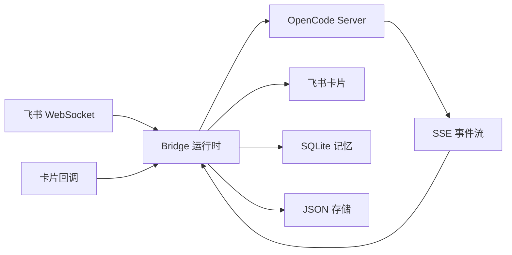

# Feishu OpenCode Bridge

中文 | [English](README.md)

[](https://github.com/Clukay-Fun/feishu-opencode-bridge/actions/workflows/ci.yml)
[](https://nodejs.org/)
[](https://www.typescriptlang.org/)
[](LICENSE)

把飞书聊天变成持久化的 OpenCode 工作台。

Feishu OpenCode Bridge 是一个独立的 TypeScript 服务，将飞书会话连接到本地 [OpenCode](https://opencode.ai) 服务器。它管理会话窗口、渲染流式过程卡、通过交互按钮处理权限审批、支持群聊协作，并维护跨会话的长期用户记忆 — 一切都在飞书内完成。

<!-- 截图：替换为实际图片 -->
<!--
<p align="center">
  
  
  
</p>
-->

## 核心能力

- **会话窗口** — 私聊、群聊、话题群各自独立的 session 绑定，支持 `single` 和 `multi` 两种会话模式。
- **流式过程卡** — OpenCode 执行期间实时更新飞书卡片。完成后按语义分块渲染 Markdown，提升长文本可读性。
- **权限按钮** — 在飞书卡片内直接审批 OpenCode 的工具调用请求，支持本次允许、始终允许和拒绝。
- **群聊协作** — @bot 一次自动绑定白名单，后续无需 @ 即可对话。通过 `/who` 和 `/leave` 管理绑定。
- **长期记忆** — 自动提取用户事实，embedding 存入 SQLite，跨会话语义召回相关上下文，并可同步到 Obsidian `profile.md`。
- **容错机制** — SSE 指数退避重连、飞书 API 自动重试与 token 缓存、请求限流、过程卡降级兜底。
- **命令透传** — 未被 bridge 接管的命令会继续透传给 OpenCode。
- **运行时护栏** — 启动前会预检飞书鉴权、OpenCode 健康、provider、存储和回调配置，避免半启动状态。

## 架构



## 快速开始

### 前置条件

- Node.js 20+
- 一个飞书自建应用，需开启机器人能力（[创建应用](https://open.feishu.cn/app)）
- 一个运行中的 OpenCode 服务（`opencode serve`）
- （可选）公网 HTTPS 端点，用于权限按钮回调

### 安装

```bash
git clone https://github.com/Clukay-Fun/feishu-opencode-bridge.git
cd feishu-opencode-bridge
npm install
cp config.example.json config.json
# 编辑 config.json，填入 feishu.appId、feishu.appSecret 和 opencode.baseUrl
```

### 启动

```bash
opencode serve          # 先启动 OpenCode
npm run dev             # 再启动 bridge
```

启动时会自动执行预检：检查飞书认证、OpenCode 连接、存储目录和回调配置。任一项失败会立即退出并给出明确的错误提示。

## 命令

| 命令 | 说明 |
|------|------|
| `/new` | 新建会话 |
| `/status` | 查看当前会话和系统状态 |
| `/abort` | 中止当前任务 |
| `/model` | 查看当前模型和活动覆盖 |
| `/model <provider>` | 查看指定 provider 下的模型 |
| `/sessions` | 当前窗口的会话列表 |
| `/sessions all` | 查看所有窗口的会话 |
| `/switch <n>` | 按编号切换会话 |
| `/who` | 查看群聊绑定状态 |
| `/leave` | 解除群聊绑定 |
| `/close` | 关闭当前会话 |
| `/close all` | 关闭当前窗口全部会话 |
| `/close <start-end>` | 按范围关闭会话 |
| `/delete` | 删除当前会话 |
| `/delete all confirm` | 删除当前窗口全部会话 |
| `/delete <index> confirm` | 按编号删除会话 |
| `/delete <start-end> confirm` | 按范围删除会话 |
| `/allow once` | 本次允许权限请求 |
| `/allow always` | 始终允许此权限 |
| `/deny` | 拒绝权限请求 |

其他 `/` 命令透传给 OpenCode（如 `/model use ...`、`/model reset`、`/review`、`/init`）。

## 配置

完整配置参考 [`config.example.json`](config.example.json)。

| 配置段 | 控制内容 |
|--------|---------|
| `feishu` | 应用凭证、机器人行为、卡片回调安全设置 |
| `opencode` | OpenCode 服务地址和目标工作目录 |
| `server` | HTTP 监听地址和公网回调 URL |
| `bridge` | 队列并发、会话模式、超时策略 |
| `storage` | JSON 存储和 SQLite 路径 |
| `logging` | 日志级别、控制台/转录开关、按日轮转 |
| `memory` | 记忆提取、embedding、召回和可选的 Obsidian 同步设置 |

### 权限按钮回调

要启用交互式权限按钮，需将 bridge HTTP 服务暴露在 HTTPS 之后并配置：

```json
{
  "server": {
    "host": "127.0.0.1",
    "port": 3000,
    "publicBaseUrl": "https://bridge.example.com/"
  },
  "feishu": {
    "cardActions": {
      "enabled": true,
      "path": "/webhook/card",
      "verificationToken": "your-token",
      "encryptKey": "your-encrypt-key"
    }
  }
}
```

如果飞书开启了事件加密推送，也需要同时配置 `encryptKey`。

## 启动前预检

bridge 启动时会检查：

- 数据目录与日志目录可写
- Feishu tenant token 可获取
- OpenCode 健康检查通过
- OpenCode 当前 worktree 与 bridge 配置一致
- provider 列表可访问
- 开启按钮模式时，卡片回调配置完整

## 部署

参见 [docs/deploy.md](docs/deploy.md) 了解基于 Caddy 的单机部署方案。

```bash
npm run build
node dist/index.js
```

Docker：

```bash
docker build -t feishu-opencode-bridge .
docker run -v ./config.json:/app/config.json feishu-opencode-bridge
```

健康检查：`GET /healthz`

## 开发

```bash
npm run typecheck       # 类型检查
npm run lint            # 代码检查
npm test                # 运行全部测试
npm run dev             # 监听模式启动
```

## 项目结构

```
src/
  bridge/       队列、路由、待确认交互状态
  config/       配置 schema（Zod）和加载器
  feishu/       飞书 API 客户端、卡片格式化、WebSocket 接入
  http/         回调服务和健康检查端点
  logging/      结构化日志，支持按日轮转
  memory/       记忆提取、embedding、SQLite 存储
  opencode/     OpenCode HTTP 客户端和 SSE 事件流
  runtime/      Bridge 编排、turn 执行、权限管理
  store/        JSON 持久化的会话和白名单存储
```

## 许可证

[Apache License 2.0](LICENSE)
