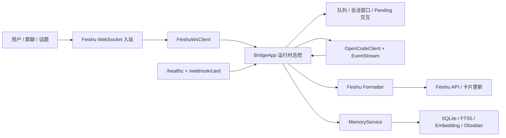

# Feishu-OpenCode Bridge 项目全貌

> 最后更新：2026-04-10（评审与优化方案更新于同日）

## 项目定位

这个仓库不是"飞书里接个机器人"那么简单——它本质上是一个把 **OpenCode 运行时产品化到飞书**里的桥接层。

它接管了会话窗口、任务过程卡、权限确认、群聊绑定、长期记忆、部署回调这些运行时职责，让飞书聊天窗口变成一个可持续工作的 OpenCode 入口。



---

## 两条核心调用链

### 启动链

```text
src/index.ts
  → loadConfig
  → runStartupPreflight
  → createLogger
  → load WhitelistStore
  → BridgeApp.start
    → load MappingStore
    → check OpenCode health + current project
    → sync stored session labels
    → start MemoryService
    → start OpenCodeEventStream
  → startBridgeHttpServer
  → start FeishuWsClient
```

### 普通消息处理链

```text
Feishu message
  → parse text/post + mention
  → group whitelist / mention gating
  → routeIncomingText
  → handleCommand 或 queue.enqueue
  → ensureSession
  → create Process Card
  → opencode.promptAsync
  → consume OpenCode SSE
  → 持续 updateTurnCard
  → finalizeAssistantReply
  → enqueue memory learn
  → 输出最终卡片内容
```

---

## 功能面梳理

### 会话管理

- 基础命令：`/new`、`/status`、`/sessions`、`/switch`
- 扩展命令：`/sessions all`、`/close`、`/close all`、`/close 1-3`
- 硬删除：`/delete`、`/delete all confirm`、`/delete 2 confirm`
- 会话窗口有模式概念：`p2p`、`group`、`topic_group` 分别可配为 `single` 或 `multi`
- topic 隔离 session，group 只共享 whitelist 不共享会话

### 消息处理

- 普通消息不是直接透传，Bridge 会先做命令识别、白名单判断、排队、会话绑定、过程卡创建、SSE 流式消费，再决定如何回飞书
- 飞书消息解析覆盖了大量边角情况：`text` / `post` 两种格式、不同 locale 的 post 结构、`<at>` 标签、嵌套 mentions、sender `open_id / user_id / app_id` 回退、重复投递去重

### 过程卡

- 不是一次性结果卡，会显示步骤进度、工具状态、最终输出
- 节流刷新：默认 120 字或 750ms 刷一次，避免刷屏

### OpenCode 事件处理

- 支持事件类型：`message.part.delta`、`message.part.updated`、`permission.asked`、`question.asked`、`session.idle` 等
- 未知事件类型会记录日志但不中断

### 权限流

- **双通道设计**：
  - 开启回调时 → 走真按钮卡片
  - 未开回调时 → 走 `/allow once`、`/allow always`、`/deny` 文本 fallback
- 权限 TTL 120 秒，仅允许发起者点击，重复点击返回幂等终态

### 群聊协作

- 首次 `@bot` 普通消息会绑定发送者，后续可免 `@` 继续说
- `/who` 和 `/leave` 是特许命令，未绑定也能用
- 解绑后再次免 `@` 会被静默忽略

### 模型管理

- `/model` 和 `/models` 都能用，bridge 负责"看模型列表"卡片
- `/model use ...`、`/model reset` 等切模型动作 passthrough 给 OpenCode

### 长期记忆

- 成功回复后自动提取"值得长期记住的用户事实"
- 存储层：SQLite + FTS5 全文搜索 + embedding 向量检索
- 检索策略：embedding recall 失败时自动回退到 recent retriever
- Obsidian 同步：`node-cron` 定时任务 + 启动补偿（错过窗口则重启后补跑）
- 提取降级：同步提取失败时新建 fallback session 用 async polling 拉取结果

### 启动预检 (Preflight)

- data / log 目录可写性
- Feishu token 有效性
- OpenCode health 检查
- worktree 是否匹配
- provider 列表是否可读
- 按钮模式下 callback 配置完整性

### HTTP 接口

| 路径              | 方法 | 用途                         |
| ----------------- | ---- | ---------------------------- |
| `/healthz`      | GET  | 健康检查                     |
| `/webhook/card` | POST | 飞书卡片 action 回调（可选） |

### 部署路径

`opencode serve` 同机运行 → bridge 本地监听 → Caddy 暴露 HTTPS → 飞书卡片回调打到公网域名

---

## 关键模块地图

| 文件 | 职责 | 行数 |
|------|------|------|
| `src/runtime/app.ts` | **编排器**（start/stop/消息入口/队列驱动） | ~651 |
| `src/runtime/command-handler.ts` | 所有 bridge 命令分发 | ~558 |
| `src/runtime/turn-executor.ts` | Turn 执行链 + SSE 事件处理 | ~524 |
| `src/runtime/app-helpers.ts` | 纯函数工具集 | ~421 |
| `src/runtime/permission-manager.ts` | 权限交互全生命周期 | ~226 |
| `src/runtime/turn-card-manager.ts` | 过程卡状态 + 流式刷新 | ~195 |
| `src/feishu/formatter.ts` | 所有飞书卡片和 post 输出构建 | ~1260 |
| `src/feishu/ws.ts` | 飞书入站、mention 解析、group gating | — |
| `src/opencode/client.ts` | OpenCode HTTP 封装 | — |
| `src/opencode/events.ts` | SSE 长连接、重连、容错 | — |
| `src/memory/index.ts` | 记忆服务编排 | — |
| `src/memory/db.ts` | SQLite、FTS5、embedding 存储 | — |
| `src/memory/extractor.ts` | 记忆提取与降级策略 | — |
| `src/http/server.ts` | 健康检查和卡片 action 回调入口 | — |

---

## 项目规模

| 指标 | 初始快照（2026-04-10） | 优化后（2026-04-10） |
|------|----------------------|---------------------|
| src 文件数 | 31 | 36 |
| 源码行数 | ~7995 | ~7938 |
| 测试行数 | ~4151 | ~4207 |
| 测试文件数 | 24 | 24 |
| 测试用例数 | 145 | 147 |
| 最大单文件行数 | 2650（app.ts） | 651（app.ts） |

---

## 阶段判断

**当前状态：可运行、可演示、可持续优化的单机产品化原型。**

### 强项

- 功能闭环完整，从入站到出站每一步都有实现
- 测试覆盖不错，147 个用例全绿
- 运行痕迹真实，有实际数据和日志佐证
- 核心编排器已拆分为 6 个职责清晰的模块
- CI 已落地，typecheck + lint + test 自动化

### 已知短板（已修复）

| 问题 | 原状 | 当前状态 |
|------|------|----------|
| 核心逻辑过于集中 | `app.ts` 2650 行 | 已拆为 6 个模块，最大 651 行 |
| 文档漂移 | README 命令面落后于实际代码 | 已更新 |
| 文档矛盾 | `docs/qa` 写着"memory 不在范围内" | 已删除过时文档 |
| SSE 解析无容错 | `JSON.parse` 裸调用 | 已加两层 try/catch + warn 日志 |
| 无 CI | 全靠本地手跑 | GitHub Actions 已配置 |

### 当前短板

| 问题 | 说明 |
|------|------|
| `formatter.ts` 1260 行 | 深嵌套 JSON 构造无抽象层，下一个拆分目标 |
| 无集成测试 | 完整消息链路缺少端到端覆盖 |
| 无 rate limiting | 恶意用户可高频发消息填满队列 |
| `encryptKey` 未实装 | 卡片回调有配置字段但无解密逻辑 |
| 命令分发代码重复 | `sendNotice` 模式重复 15+ 次 |

---

## 技术评审打分

> 评审视角：以"一个人写的、准备上生产的单机桥接层产品"为锚点，不拿微服务架构或大团队标准来套。
> 满分 10 分制。

### 评分历史

| 时间 | 总分 | 触发事件 |
|------|------|----------|
| 2026-04-10 初始评审 | 7.7 | 首次代码审查 |
| 2026-04-10 优化后 | **8.1** | 完成 app.ts 拆分 + SSE 容错 + CI + 文档修正 |

### 当前总分：8.1 / 10

---

### 一、架构设计 — 8.5（+0.5）

**做对了什么**

- **端口与适配器（Ports & Adapters）的雏形**已经成型。`OutboundPort` 抽象了飞书发消息能力，`OpenCodeClient` 封装了 HTTP 接口，`MemoryRetriever` 定义了检索接口——这让核心逻辑不直接耦合外部协议，测试可以注入 mock。
- **职责边界清晰的小模块**做得好：`QueueRegistry`（排队）、`TurnWatchdog`（超时看门狗）、`transitionTurn`（状态机）、`routeIncomingText`（路由）、`SessionWindows`（窗口管理）——每个都是纯逻辑、可独立测试、无副作用。
- **配置层用 Zod 做了完整的 schema 校验 + 类型推导**，还加了跨字段 `superRefine`（embedding 必须有 provider、obsidian 必须有 vaultPath）。这在个人项目里属于高标准。
- **[已修复] `BridgeApp` 已从 2650 行拆分为 6 个职责明确的模块**：编排器（651 行）、命令处理（558 行）、Turn 执行（524 行）、纯函数（421 行）、权限管理（226 行）、过程卡管理（195 行）。God Object 问题基本解决。

**剩余扣分点**

- `formatter.ts` 1260 行纯 JSON 构造，没有模板化。每次飞书卡片 API 改版，手工改嵌套对象的维护成本极高。

---

### 二、代码质量 — 7.5（不变）

**做对了什么**

- **TypeScript 用得严谨**。全量 `strict`，接口类型定义精确（`TurnStatusCardView`、`PermissionCardActionValue`），discriminated union + exhaustive switch 覆盖事件分支。
- **错误处理一致**。`try/catch` 后统一走 `logger.log(..., "warn")` 并降级而非崩溃，memory extractor 的 sync → fallback → 空数组三级降级是典型示范。
- **无全局可变状态**。所有 runtime 状态都挂在 `BridgeApp` 实例上，`Map/Set` 管理生命周期，`stop()` 会 `clearTimeout` 并排空队列。
- **工具函数纯净**。`isRecord`、`readOptionalString`、`dedupe`、`sanitizeSearchQuery` 这些底层函数无副作用、可组合，命名准确。
- **[已修复] 纯函数已搬出到 `app-helpers.ts`**，不再和类逻辑混在一起。

**剩余扣分点**

- **代码重复**。`handleCommand` 里 `buildNoticeCardPayload` 的调用模式（title + template + icon + message + 日志参数）重复了 15+ 次，每次只换几个字段。应该提取一个 `sendNotice(message, opts)` helper。
- **SSE 事件处理的 `handleEvent` 方法**约 130 行，全是 `if (event.type === "xxx") { ... return; }` 串联，当事件类型增加时会持续膨胀。更好的做法是 event handler registry。
- **`executeTurn` 的 `new Promise` 构造器**包含订阅、回调、超时、fallback 多重嵌套，认知负荷高。这是整个项目里最难读的一段代码。

---

### 三、可靠性 — 9.0（+0.5）

**这是项目最强的维度。**

- **三级超时看门狗**（首事件 / 事件间隔 / 总时长）比大多数生产系统都要完善。`TurnWatchdog` 设计干净，`snoozeEventGap` 在权限等待时动态延长超时，说明作者真跑过并遇到过真实问题。
- **SSE 重连**使用指数退避（1s → 2s → 5s → 10s → 30s 封顶），双端点 fallback（`/event` → `/global/event`），断线后自动重连但不无限重试。
- **[已修复] SSE 解析已加容错**。`parseSseBlock` 对 `JSON.parse` 和 `normalizeEventPayload` 都做了 try/catch，坏事件跳过并记 warn 日志，不再打断整个事件流。
- **权限流幂等**。`resolvedAt` + `resolution` 字段保证重复点击返回终态而不重复提交。`permissionProcessing Set` 防止并发处理同一权限。
- **队列满了会拒绝并告知用户**（而非静默丢弃）。
- **Memory 停机排空**（`drain` + `shutdownDrainTimeoutMs`）保证 inflight 的记忆提取不丢。
- **Preflight 检查**在启动前就拦截配置错误，不会带着坏配置运行到一半才崩。

**剩余扣分点**

- 没有对飞书 API 调用做重试。网络抖动时 `sendMessage` / `updateMessage` 失败会直接丢失回复。

---

### 四、测试 — 7.5（不变）

**做对了什么**

- **24 个测试文件 × 147 个用例，覆盖率按模块分布均匀**：app 命令面、权限 action、群聊、formatter、memory（db / extractor / retriever / service / obsidian）、queue、router、session-windows、state-machine、config、preflight、sanitize、logger、http-server。这在个人项目里是罕见的覆盖广度。
- **测试文件命名规范**（`app-command-surface.test.ts`、`app-permission-actions.test.ts`），按功能域而非文件名组织。
- **拆分合理**。测试按命令面 / 权限 / 白名单 / 群聊拆成了 4 个测试文件，职责清晰。
- **[新增] SSE 容错测试**覆盖了非法 JSON 和缺失 type 字段两种场景。
- **[新增] Memory extractor 降级测试**覆盖了 sync → async polling fallback 链路。

**剩余扣分点**

- 没看到集成测试或端到端测试。所有测试都是单元级，通过 mock 隔离了外部依赖。这意味着"飞书消息进来 → 过程卡刷新 → 最终回复"这条完整链路没有测试覆盖。

---

### 五、可维护性 — 8.0（+1.5）

**已大幅改善。**

- **[已修复] `app.ts` 从 2650 行拆到 651 行**。改一个命令只需打开 `command-handler.ts`，改权限只需打开 `permission-manager.ts`。每个模块的认知负荷降到可控范围。
- **[已修复] 文档已对齐**。README 命令面已补全，过时的 memory 范围声明已删除，差距矩阵已更新。
- **[已修复] CI 已落地**。GitHub Actions 跑 typecheck + lint + test，合入 main 有自动化安全网。
- 小模块（queue、watchdog、state-machine、session-windows、router、sanitize）的可维护性一直很好。

**剩余扣分点**

- `formatter.ts` 1260 行的深嵌套 JSON 对象没有抽象层，仍是下一个拆分目标。
- `command-handler.ts` 中 `sendNotice` 模式重复 15+ 次，可提取 helper 降低噪音。

---

### 六、安全性 — 7.5（不变）

- **权限仅限发起者操作**（`requesterOpenId !== actorOpenId` 校验）。
- **权限有 TTL**，过期后不可操作。
- **白名单机制**（`allowedOpenIds`）控制访问。
- **`sanitizeSearchQuery`** 对 FTS5 查询做了字符过滤，防注入。
- **`verificationToken` 校验**卡片回调来源。

**剩余扣分点**

- 卡片回调的 `encryptKey` 有配置字段，但代码里没看到实际解密逻辑。
- 没有 rate limiting。恶意用户可以高频发消息填满队列。

---

### 七、工程成熟度 — 8.5（+0.5）

- 配置管理（Zod schema + 类型推导）：优秀
- 日志系统（结构化日志 + transcript 日志分离）：优秀
- 启动预检：优秀
- 优雅停机（排空 + 超时）：优秀
- 数据库迁移（`PRAGMA table_info` + 动态 `ALTER TABLE`）：实用
- **[已修复] CI 已配置**（GitHub Actions，typecheck + lint + test）
- 没有 Dockerfile、没有监控指标：扣分

---

### 分项汇总

| 维度 | 初始得分 | 当前得分 | 权重 | 加权 |
|------|----------|----------|------|------|
| 架构设计 | 8.0 | **8.5** | 20% | 1.70 |
| 代码质量 | 7.5 | **7.5** | 20% | 1.50 |
| 可靠性 | 8.5 | **9.0** | 20% | 1.80 |
| 测试 | 7.5 | **7.5** | 15% | 1.13 |
| 可维护性 | 6.5 | **8.0** | 15% | 1.20 |
| 安全性 | 7.5 | **7.5** | 5% | 0.38 |
| 工程成熟度 | 8.0 | **8.5** | 5% | 0.43 |
| **总分** | **7.7** | **8.1** | **100%** | **8.14** |

---

### 已完成的 Top 3 优先级

1. ~~**拆 `app.ts`。**~~ 已完成（commit `5becab6`）。2650 行拆为 6 个模块，编排器 651 行。
2. ~~**加 CI。**~~ 已完成（commit `b582f89`）。GitHub Actions 跑 typecheck + lint + test。
3. ~~**补 SSE 解析的错误处理。**~~ 已完成（commit `2aa47df`）。两层 try/catch + warn 日志。

---

## 已完成的优化方案回顾

### 优化一：拆分 `app.ts` — 已完成

| 文件 | 实际行数 | 文档预估 |
|------|----------|----------|
| app.ts（编排器） | 651 | ~630 |
| command-handler.ts | 558 | ~600 |
| turn-executor.ts | 524 | ~430 |
| app-helpers.ts | 421 | ~410 |
| permission-manager.ts | 226 | ~250 |
| turn-card-manager.ts | 195 | ~130 |

分 5 步完成，每步一个 commit，全量测试始终通过。采用"一行转发"策略，最大化降低每步风险。

### 优化二：加 CI — 已完成

`.github/workflows/ci.yml` 已配置，覆盖 push main/codex/* 和 PR to main。

### 优化三：SSE 解析错误处理 — 已完成

`parseSseBlock` 已加两层 try/catch，`consumeStream` 循环中坏块记 warn 日志。测试新增 2 个用例覆盖非法 JSON 和缺失 type 字段。

---

## 冲 9.0 分的下一轮优化方案

当前 8.1 分，距离 9.0 需要再提升 0.9 分。以下方案按提分效率排序。

### 提分路线图

| 维度 | 当前 | 目标 | 提分幅度 | 加权贡献 |
|------|------|------|----------|----------|
| 代码质量 | 7.5 | 8.5 | +1.0 | +0.20 |
| 测试 | 7.5 | 9.0 | +1.5 | +0.23 |
| 可维护性 | 8.0 | 9.0 | +1.0 | +0.15 |
| 可靠性 | 9.0 | 9.5 | +0.5 | +0.10 |
| 安全性 | 7.5 | 9.0 | +1.5 | +0.08 |
| 架构设计 | 8.5 | 9.0 | +0.5 | +0.10 |
| 工程成熟度 | 8.5 | 9.0 | +0.5 | +0.03 |
| **预期总分** | **8.1** | | | **8.1 + 0.89 ≈ 9.0** |

---

### 优化四：消除命令分发代码重复（代码质量 7.5 → 8.0）

#### 问题

`command-handler.ts` 里 `buildNoticeCardPayload` + `sendPayload` 的调用模式重复了 15+ 次：

```typescript
await this.context.sendPayload(message.chatId, buildNoticeCardPayload({
  title: "提醒",
  template: "yellow",
  iconToken: "maybe_outlined",
  message: "当前会话正在执行任务，请先发送 `/abort`。",
  messageIconToken: "maybe_outlined",
  messageIconColor: "yellow",
}), {
  event: "final message sent",
  transcriptType: "outbound-final",
  textPreview: "当前会话正在执行任务，请先发送 `/abort`。",
  len: 20,
}, { replyToMessageId: message.messageId });
```

每次只换 title、template、icon、message 四个字段，但要写 12 行样板代码。

#### 方案

在 `command-handler.ts` 内提取一个 `sendNotice` 私有方法：

```typescript
private async sendNotice(
  chatId: string,
  replyToMessageId: string,
  options: {
    title: string;
    template: "yellow" | "grey" | "blue" | "red" | "orange";
    icon: string;
    message: string;
  },
): Promise<void> {
  await this.context.sendPayload(chatId, buildNoticeCardPayload({
    title: options.title,
    template: options.template,
    iconToken: options.icon,
    message: options.message,
    messageIconToken: options.icon,
    messageIconColor: options.template,
  }), {
    event: "final message sent",
    transcriptType: "outbound-final",
    textPreview: options.message,
    len: options.message.length,
  }, { replyToMessageId });
}
```

每处调用从 12 行缩减到 1 行：

```typescript
await this.sendNotice(message.chatId, message.messageId, {
  title: "提醒", template: "yellow", icon: "maybe_outlined",
  message: "当前会话正在执行任务，请先发送 `/abort`。",
});
```

#### 预计效果

- `command-handler.ts` 减少约 150 行样板代码
- 新增的卡片通知不需要复制粘贴，只需调 `sendNotice`
- 风险极低：纯重构，行为不变

---

### 优化五：补集成测试（测试 7.5 → 8.5）

#### 问题

当前 147 个测试全是单元级，通过 mock 隔离了外部依赖。缺少覆盖完整链路的集成测试。

#### 方案

新建 `test/integration/` 目录，补 2-3 个集成测试文件：

**5a. 消息处理全链路 `test/integration/message-flow.test.ts`**

```typescript
// 不 mock OpenCodeClient，而是用一个 FakeOpenCodeServer（内存实现）
// 测试：发消息 → 创建 session → 创建过程卡 → SSE 事件 → 最终回复
it("processes a message end-to-end", async () => {
  const fake = new FakeOpenCodeServer();
  const app = createBridgeApp({ opencode: fake });

  await app.handleIncomingMessage(createMessage("帮我写个函数"));

  // 验证 outbound 收到了过程卡 + 最终回复
  expect(outbound.sentMessages).toHaveLength(2);
  expect(outbound.sentMessages[1].content).toContain("已完成");
});
```

**5b. 权限流全链路 `test/integration/permission-flow.test.ts`**

```typescript
// 测试：发消息 → SSE 触发 permission.asked → 发权限卡 → 点击 allow once → 继续执行 → 最终回复
it("handles permission flow end-to-end", async () => { ... });
```

**5c. 队列竞争 `test/integration/queue-concurrency.test.ts`**

```typescript
// 测试：同一 conversationKey 同时发 3 条消息 → 排队 → 按序执行 → 各自回复
it("queues concurrent messages and processes in order", async () => { ... });
```

#### 基础设施

需要一个 `FakeOpenCodeServer` 类，实现 `OpenCodeClient` 的接口但在内存中模拟行为：
- `health()` → 返回固定版本
- `createSession()` → 内存创建
- `promptAsync()` → 触发预设的 SSE 事件序列
- `getSessionMessages()` → 返回预设消息

这个 Fake 也可以被后续的 E2E 测试复用。

#### 预计效果

- 覆盖最核心的 3 条完整链路
- 能发现单元测试 mock 隐藏的集成问题
- 预计新增 5-8 个测试用例

---

### 优化六：飞书 API 重试（可靠性 9.0 → 9.5）

#### 问题

`sendMessage` / `updateMessage` / `replyMessage` 没有重试。飞书 API 偶尔返回 5xx 或网络超时，当前会直接丢失回复。

#### 方案

在 `src/feishu/api.ts` 中包装一个通用重试器：

```typescript
async function withRetry<T>(
  fn: () => Promise<T>,
  options: { maxAttempts: number; baseDelayMs: number; logger: Logger },
): Promise<T> {
  let lastError: Error | null = null;
  for (let attempt = 0; attempt < options.maxAttempts; attempt++) {
    try {
      return await fn();
    } catch (error) {
      lastError = error instanceof Error ? error : new Error(String(error));
      if (attempt < options.maxAttempts - 1) {
        const delay = options.baseDelayMs * Math.pow(2, attempt);
        options.logger.log("feishu/api", "retrying", { attempt, delay }, "warn");
        await sleep(delay);
      }
    }
  }
  throw lastError;
}
```

只对 `sendMessage`、`replyMessage`、`updateMessage` 三个方法启用，默认 3 次尝试、基础延迟 500ms。

#### 预计效果

- 飞书 API 偶发故障不会丢消息
- 指数退避避免 API 限流时雪崩
- 改动集中在 `api.ts`，不影响业务逻辑

---

### 优化七：Rate Limiting + encryptKey 实装（安全性 7.5 → 9.0）

#### 7a. Rate Limiting

在 `BridgeApp.handleIncomingMessage` 入口加基于 `senderOpenId` 的滑动窗口限流：

```typescript
// 每个用户 60 秒内最多 20 条消息
private readonly rateLimiter = new SlidingWindowRateLimiter({
  windowMs: 60_000,
  maxRequests: 20,
});
```

超限时返回友好提示卡片，不静默丢弃。

#### 7b. encryptKey 解密

飞书卡片回调支持 AES-256-CBC 加密，config 里已有 `encryptKey` 字段。在 `src/http/server.ts` 的卡片回调处理中：

```typescript
if (config.feishu.cardActions.encryptKey) {
  body = decryptFeishuCallback(body, config.feishu.cardActions.encryptKey);
}
```

实现 `decryptFeishuCallback`，参照飞书官方文档的 AES 解密规范。

#### 预计效果

- Rate limiting 防止恶意刷量，保护 OpenCode 后端
- encryptKey 解密补上卡片回调的安全缺口
- 两项改动相互独立，可分别落地

---

### 优化八：formatter 卡片构建器抽象（可维护性 8.0 → 8.5、架构设计 8.5 → 9.0）

#### 问题

`formatter.ts` 1260 行，每个卡片都是手写深嵌套 JSON。结构重复但微妙差异多，改一个卡片要在嵌套层里小心翼翼地找位置。

#### 方案

提取一组卡片构建器 DSL，把重复的嵌套结构隐藏在组合函数后面：

```typescript
// src/feishu/card-builder.ts
export const card = {
  columnSet: (columns: Column[], options?: ColumnSetOptions) => ({ ... }),
  column: (elements: Element[], options?: ColumnOptions) => ({ ... }),
  markdown: (content: string, options?: MarkdownOptions) => ({ ... }),
  divider: () => ({ tag: "hr" }),
  icon: (token: string, color?: string) => ({ ... }),
};
```

改造前：
```typescript
{
  tag: "column_set",
  horizontal_spacing: "8px",
  horizontal_align: "left",
  columns: [{
    tag: "column",
    width: "weighted",
    elements: [{
      tag: "markdown",
      content: "**当前会话**",
      text_align: "left",
      text_size: "normal",
      margin: "0px 0px 0px 0px",
      icon: { tag: "standard_icon", token: "reply-cn_outlined", color: "grey" },
    }],
    // ... 更多嵌套
  }],
}
```

改造后：
```typescript
card.columnSet([
  card.column([
    card.markdown("**当前会话**", { icon: card.icon("reply-cn_outlined", "grey") }),
  ]),
])
```

#### 预计效果

- `formatter.ts` 预计从 1260 行降到 ~600-700 行
- 新增卡片类型的开发速度提升 3 倍以上
- 飞书卡片 API 改版时，只需改 `card-builder.ts` 中的底层构造

---

### 优化九：Dockerfile + 健康指标（工程成熟度 8.5 → 9.0）

#### 9a. Dockerfile

```dockerfile
FROM node:20-slim AS builder
WORKDIR /app
COPY package*.json ./
RUN npm ci
COPY . .
RUN npm run build

FROM node:20-slim
WORKDIR /app
COPY --from=builder /app/dist ./dist
COPY --from=builder /app/node_modules ./node_modules
COPY --from=builder /app/package.json ./
EXPOSE 3000
CMD ["node", "dist/index.js"]
```

#### 9b. 健康指标

在 `/healthz` 响应中返回结构化状态：

```json
{
  "status": "ok",
  "uptime": 86400,
  "opencode": "connected",
  "eventStream": "connected",
  "memory": { "enabled": true, "queueSize": 2 },
  "sessions": { "active": 5, "total": 42 }
}
```

#### 预计效果

- 容器化部署开箱即用
- 运维可通过 healthz 判断各子系统状态

---

### 执行顺序建议

```text
Phase 1（冲 8.5）:
  优化四（sendNotice 去重）      → 代码质量 7.5 → 8.0  | 2 小时
  优化六（飞书 API 重试）        → 可靠性 9.0 → 9.5    | 3 小时

Phase 2（冲 9.0）:
  优化五（集成测试）             → 测试 7.5 → 8.5      | 1-2 天
  优化七（rate limit + encrypt） → 安全性 7.5 → 9.0    | 半天
  优化八（formatter DSL）        → 可维护性 + 架构      | 1-2 天
  优化九（Docker + 健康指标）    → 工程成熟度 8.5 → 9.0 | 半天
```
